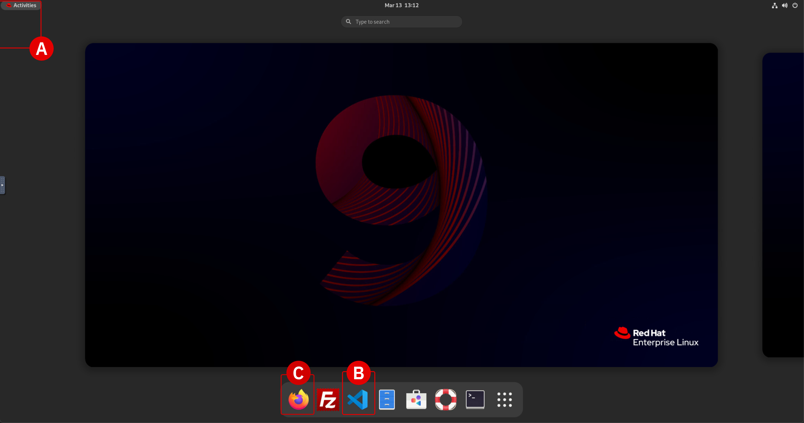
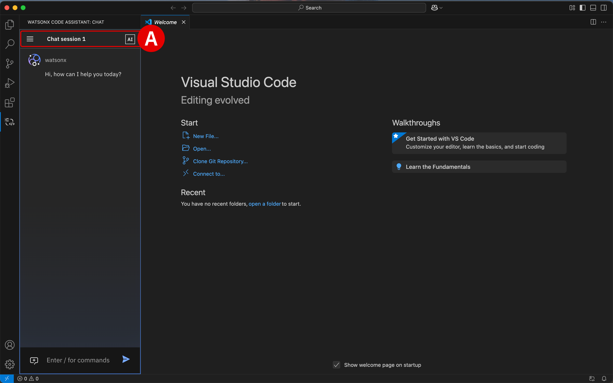

# **Objectives and requirements**</br>*Modernizing WebSphere to Liberty*

## **i. About this lab**

!!! quote "SECTION I. TERMINOLOGY"
    For readability, <a href="https://www.ibm.com/products/websphere-application-server" target="_blank">**IBM WebSphere Application Server**</a> (WAS) in this chapter is referred to in shorthand as "WebSphere", unless noted otherwise. Similarly, <a href="https://www.ibm.com/products/cloud-pak-for-applications/liberty" target="_blank">**IBM WebSphere Liberty**</a> is referenced in shorthand as simply "Liberty".

</br>
The approach taken with each module of **Modernizing WebSphere to Liberty**,  engaging with IBM watsonx Code Assistant's (WCA) Chat functionality in the chapters ahead, is to emulate the experience of collaborating with a trusted colleague on how to best take on the modernization of WebSphere Application Server code: segmented by specific use cases, tackling particular business functions that need to be revitalized for cloud-native, and exploring precise pain points within an organizations's code base. The WCA Chat experience reflects how you and that trusted colleague might, together, approach a scenario like modernizing usage of Enterprise JavaBeans with WebSphere Liberty, as an example.

Thinking about modernization in discrete scenarios such as these, where the aperture is narrowly focused on a specific piece of functionality or use case— rather than trying to modernize an entire, complex application stack altogether —has immense value. It is far more akin and practical to the real-world scenarios that *you* will encounter during engagements with other organizations or enterprises in the marketplace. Entrusted with bestowing best practices for how that organization can modernize specific pain points in their application code; *not* taking on the task of modernizing the *entirety* of their application stack "in one go."

Crafting complex modernization plans for enterprise-scale applications cannot be approached as explicit "A, then B, followed by C" rulebooks or rigid decision trees. It is essential that you understand how to approach modernization as a collaborative, problem-solving oriented, question-and-answer refinement exercise. WCA Chat, which you will use to these ends in the following modules, is an ideal mechanism for refining the correct modernization approach.

---

## **ii. Hands-on topics**

For each module of the *Modernizing WebSphere to Liberty* lab, participants will have the opportunity to dissect the contents and purpose of legacy **WebSphere Application Server** (**WAS**) code, examine its limitations in the context of more up-to-date alternatives, and then compare that to a best-practices implementation of that equivalent codebase written in **WebSphere Liberty**.

Afterwards, participants will go hands-on with the **IBM watsonx Code Assistant** (**WCA**) Standard environment to reproduce the steps of modernizing the WAS legacy code into Liberty code. Differences in the two code bases and the benefits of WCA's approach to code modernization will also be examined.

</br>

| MODERNIZATION TASK | WEBSPHERE APPLICATION | LIBERTY APPLICATION |
| - | - | - |
| <a href="https://ibm.github.io/wca-l4/appmod/2/" target="_blank">**Basic migration capabilities**</a> | **WebSphere Enterprise Archive (EAR)** configuration, at enterprise scale, becomes cumbersome to maintain and can often result in frequent deployment delays (or human-induced configuration errors) each time the modules need to be modified. | **Liberty Web Archive (WAR)** configurations remove the need for multiple external descriptors and consolidate settings into a single, unified file. |
| <a href="https://ibm.github.io/wca-l4/appmod/3/" target="_blank">**Configuration and dependency management**</a> | **WebSphere class loader configuration** implementation suffers from significant (and unnecessary) complexity owing to bloated class-loader configurations. | **Liberty server configuration** is expected to manage dependencies and simplify the overall process of application configuration. |
| <a href="https://ibm.github.io/wca-l4/appmod/4/" target="_blank">**APIs and libraries**</a> | **WebSphere Scheduler APIs** may not be immediately portable in their current form, they are potentially more costly to maintain than Liberty counterparts, and have less functionality due to outdated implementations. | **Liberty's Jakarta EE-templated APIs** are more transferable across vendors and platforms, are built to cloud-native architecture by design, and are portable to containers. |
| <a href="https://ibm.github.io/wca-l4/appmod/5/" target="_blank">**Enterprise JavaBeans (EJB) modernization**</a> | **WebSphere EJB with XML** represent server-side components used by Java Enterprise Edition (Java EE or Jakarta EE) to encapsulate repeatable business logic. They are more challenging to maintain and prone to human-induced errors. | **Liberty EJBs with annotations** use Java instead of XML, applying them directly within Java classes for configuration. In many cases, this reduces the need for external XML files and eases maintainability. |
| <a href="https://ibm.github.io/wca-l4/appmod/6/" target="_blank">**Java Message Service integration**</a> | **WebSphere's MQ JMS integration** uses complex configurations made up of verbose XML or admin console requirements. They can be difficult to maintain due to their dispersed nature. | **Liberty's MQ JMS integration** provides a more centralized pattern to simplify the process of troubleshooting messaging integrations and maintaining existing policies. |
| <a href="https://ibm.github.io/wca-l4/appmod/7/" target="_blank">**Security modernization**</a> | **WebSphere's XML-based security** is challenging to understand and maintain due to XML file separation from the supporting Java code, which tends to lower developer productivity due to frequent context-switching. | **Liberty's annotation-based security** reduces the need for external configuration and instead centralizes security declarations closer to the actual code implementation. |

---

## **iii. Prerequisites**

This lab requires that participants configure the unique **watsonx Code Assistant Standard Plan** entitlement that was provisioned and assigned exclusively for this hands-on IBM Training course. 

These IBM Cloud environments are single-tenant and assigned and enrollment time to each participant; as such, they require a few steps of configuration before the API access key can be created and the code generation labs can begin.

---

## **iv. IBM Cloud account setup**

Upon enrolling in the **watsonx Code Assistant: Modernizing Applications (*W7S220G*)** course, you will receive **two** emails with the following headers:

- ```Reservation Ready on IBM Technology Zone``` indicates that your WCA Standard Plan has been successfully provisioned on IBM Cloud. 
- ```Account: Action required: You are invited to join an account in IBM Cloud``` provides additional steps required by the administrator (you) to perform in order to fully configure the WCA plan's API key for use with integrated development environments (IDE) — such as the Visual Studio Code environment provided within the hands-on virtual machine (VM).

Steps must be taken to link the WCA service and IBM Cloud accounts at this time.

---

1. Click the **Join now**^[A]^ button within the body of the ```Account: Action required: You are invited to join an account in IBM Cloud``` email.

    A web browser tab will launch and redirect to IBM Cloud

    </br>
    {: loading=lazy width="400"}
    </br>
    {: loading=lazy width="400"}

---

2. Check the **I accept the product Terms and Conditions of this registration form**^[A]^ box under the *Account Notice* header.

    Click **Join account**^[B]^ to continue.

    </br>
    
    
---

3. You will be presented with a prompt asking for your permission to switch your assigned IBM Cloud account — which will resemble something like `itz-watsonx-24`.

    Click **Proceed**^[A]^ to confirm.

    !!! note "LOCATING THE ACCOUNT NAME"
        Participants can retrieve the name of the WCA service account (`itz-watsonx-24`, etc.) by looking at the contents of the **Account: Action required: You are invited to join an account in IBM Cloud** email: *IBM Technology Zone invited you to join the following IBM Cloud account: itz-watsonx-...*

    </br>
    

---

4. The IBM Cloud dashboard will now load within your web browser.

    At this time, confirm you are logged in under the WCA service account by inspecting the drop-down menu^[A]^ as shown in the screenshot below.

    !!! note "SWITCHING BETWEEN IBM CLOUD ACCOUNTS"
        You can toggle between various IBM Cloud accounts at-will. However, for the purposes of this lab it's best that you remain under the WCA service^[B]^ account.
        
    </br>
    

---

5. Return to the second email with the header ```Reservation Ready on IBM Technology Zone``` and click on the **View My Reservations** button to inspect the environment's access details.

---

6. A web browser tab will open, directing you to the IBM Technology Zone reservation summary page. Scroll down the page to the *Reservations Details* section and locate the following values. You will need to record these to a notepad for future reference.

    - *IBM Cloud Service ID*^[A]^
    - *IBM Cloud API key*^[B]^
    - *WCA URL*^[C]^

    </br>
    

---

7. Open a new browser tab and navigate to the **WCA URL** recorded in Step 6.

    - A *Resource list* view on IBM Cloud will load
    - Click the **Launch watsonx Code Assistant**^[A]^ button to continue

    </br>
    

---

## **v. Configure the environment**

A new tab will load to present the **WCA Dashboard**, which for a first-time login will automatically prompt you to configure the environment.

---

8. When presented with the *Set up watsonx Code Assistant for Standard plan* panel, click on the **Set up**^[A]^ button to continue.

    </br>
    

---

9. *Type of installation* configuration options must be configured. Select **Single user**^[A]^.

    </br>
    

---

10. Having specified the installation type, more options will unlock further down the page under the *Steps to complete* header.

    Click the **blue arrow**^[A]^ icon to the right of the *Create a deployment space* option.

    </br>
    

---

11. Configure the **Create a deployment space** page as follows:

    - *Name^[A]^:* Assign a name of your choosing to the deployment space (e.g. `wca-l4`)
    - *Description^[B]^:* Optional
    - *Select storage service^[C]^:* Do not change. IBM Technology Zone has automatically assigned Cloud Object Storage space for this reservation.
    - *Code assistant service^[D]^:* Click the drop-down menu and select the WCA service belonging to your account.

    All other fields can remain as their default values. When ready, click **Create**^[E]^ and remain on the page for the deployment to finish.

    </br>
    

---

12. Once the deployment space has been prepared, a pop-up alert will display *"The space is ready"*. Click the **X**^[A]^ icon in the top-right corner to dismiss the message and continue with the configuration steps.

    </br>
    

---

13. The web browser will return to the set up wizard, which now displays additional options under the *Steps to complete* section.

    - Notice that the *Create a deployment space* step has been marked as complete.

    - Click the **blue arrow**^[A]^ icon to the right of the *Select your license preference for response generations* option to continue.

    </br>
    

---

14. The *Display of Code Suggestions* page permits users to configure how to display code suggestions returned by the WCA service.

    - **Do not change** any of the settings, but you are welcome to review them if you wish
    - **Close** the page and return to the set up wizard

    </br>
    

---

15. **Check**^[A]^ the box to the left of the *Select your license preference for response generations* option to mark the task as complete.

    - A prompt will appear to indicate that all setup tasks are now complete
    - Click the **Go to home page**^[B]^ button to conclude the setup

    </br>
    
    </br>
    

---

## **vi. Create a service ID and API key**

Participants will use this API key later to enable Visual Studio Code extensions or Eclipse IDE plug-ins to communicate with the WCA service.

---

16. Open a new web browser tab and navigate to the <a href="https://cloud.ibm.com/iam/serviceids" target="_blank">**IBM Cloud Service IDs**</a> admin page.

    - Verify that the **Service IDs**^[A]^ tab is open and that the **Resource Group**^[B]^ is set to the ITZ-provisioned WCA account (Steps 7-8)
    - Click **Create service ID**^[C]^ to continue

    </br>
    

---

17. Set the **Name**^[A]^ field equal to `IBM watsonx Code Assistant user` or another name of your choosing. Click the **Create**^[B]^ button to continue.

    </br>
    

---

18. From the tabs along the left side of the page, click **API Keys**^[A]^. Once it loads, click **Create**^[B]^ to continue.

    </br>
    

---

19. Create a new **IBM Cloud API Key** with the following parameters:

    - *Name^[A]^:* `IBM watsonx Code Assistant API key`
    - *Leaked action^[B]^:* `Disable the leaked key`
    - *Session creation^[C]^:* `No`
    - When ready, click **Create**^[D]^ to finalize the key

    </br>
    

---

20. A prompt will appear reporting that *API key successfully created*.

    - Click the **Copy**^[A]^ button and record the *WCA API Key* to your notebook for reference later
    - It's recommended that you also **Download** the key as a redundancy
    - When ready, **close**^[B]^ the window

    </br>
    

---

## **vii. Add the service ID to the WCA deployment space**

With the *Service ID* and *WCA API Key* now generated, they need to be associated with your WCA instance — specifically, the WCA *Deployment Space*. This will be the way in which the WCA extension (VS Code or Eclipse IDE) communicates with the WCA service.

---

21. Return to the **WCA Dashboard** web browser tab (where you left off in Step 19).

    - Click the **stacked tiles**^[A]^ in the top-left corner of the dashboard to expand the menu items along the left-hand side
    - Click on the **Deployments**^[B]^ tab

    </br>
    

---

22. Within the table of existing deployments, click the **wca-l4**^[A]^ deployment (or whatever name you chose to assign the deployment created in Step 15).

    </br>
    

---

23. From the tabs along the top, click the **Manage**^[A]^ tab. Then, from the left-hand side options, click the **Access control**^[B]^ tab.

    </br>
    
    </br>
    

---

24. Click the **Add collaborators**^[A]^ button to expand a list of options, then click **Add service IDs**^[B]^ to continue.

    </br>
    

---

25. Within the table of *Service IDs*, you should see 1 entry for the `IBM watsonx Code Assistant user` that was created in Step 17.

    - **Click**^[A]^ the box to the left of the ID
    - **Click**^[B]^ the *Role* box to the right of the ID and select **Editor** from the drop-down menu
    - Click **Add**^[C]^ to finalize the operation

    </br>
    

---

26. Confirm that the `IBM watsonx Code Assistant user` *Service ID* now appears within the list of approved *Collaborators* under the **Access Control** tab.

    The deployment and initial configurations of the watsonx Code Assistant (SaaS) Standard Plan service on IBM Cloud is now complete. At this stage the WCA Standard plan has been authorized for use via the `IBM watsonx Code Assistant API key`.

---

## **viii. Accessing and using the virtual machine**

Before getting started with WCA, you will first setup Visual Studio Code (commonly referred to as VS Code) within the lab's virtualized machine (VM). This will provide an integrated development environment for experimenting with WCA's generative AI capabilities.

---

27. From the `learn.ibm.com` course page, navigate to the **Lab Environment** section and launch the `IBM SPVC Labs: W7S220G` VM environment.

    - Provisioning typically takes about 90 minutes or less
    - Periodically refresh this page and click the **Direct Environment Access**^[A]^ button to test if the VM is available
    - When the page displays a **Red Hat** VM box, the environment is ready for access
    - Click the VM box^[B]^ to launch the hands-on environment

    </br>
    

    </br>
    

---

28. Select the `techzone`^[A]^ login when prompted.

    - Enter the following for the password:
    ``` script
    IBMDem0s!
    ```
    - Press ++enter++ to complete the VM login

    </br>
    

---

29. Once you have successfully authenticated, click the **Activities**^[A]^ button in the top-left corner of the interface to pull open the list of available applications from the bottom of the screen.
    - Click the **Visual Studio Code**^[B]^ application shortcut at the bottom of the desktop to start up the service.
    - You may access the web browser at any time by clicking the **Activities**^[A]^ button and then launching **Firefox**^[C]^, as shown.

    </br>
    

    !!! note "COPY AND PASTE INSTRUCTIONS INTO THE VIRTUAL MACHINE"
        As you are running the lab environment inside a VM, it is not possible to "paste" lab instructions or information from your local machine's clipboard directly into the VM. Instead, you may use the **Send Text** feature located in the top-center of the VM interface.

        - Place your cursor within the VM where you wish to paste instructions or text from the clipboard
        - Click the **Send Text** icon^[A]^ to open a pop-up window.
        - Paste your local machine's clipboard contents into the input field^[B]^
        - Click the **Send Text** button^[C]^ to the right of the input field to "paste" the contents into the VM
        - Click the X icon^[D]^ to close the pop-up window

        </br>
        

        </br>
        

---

## **ix. Activate the VS Code extension**

Finally, the API key must be added to the VM lab environment that was provisioned as part of this course. The VM has been prepared ahead of time with Visual Studio (VS) Code, the necessary enterprise Java drivers, and pre-populated data sets required to run the lab.

At this stage, participants need only log in using the API key created earlier (Step 20) to authorize the VS Code extension for use with WCA. The VS Code extension supports all the features of the Essentials plan, plus enterprise Java modernization capabilities, enhanced code explanation, and enhanced unit test generation.

---

30. To engage WCA within VS Code, click on the **watsonx Code Assistant**^[A]^ icon from the left-hand side of VS Code interface. You will be greeted with a `Welcome, let's get started!` prompt within the IDE.

    </br>
    

---

31. Now let's authorize the extension for use with the WCA service provisioned on IBM Cloud. From the WCA panel, click **Log in with your API key**^[A]^ to continue.

    </br>
    

---

32. A drop-down menu will open at the top of the VS Code interface. **Copy and paste**^[A]^ the *WCA API Key* that was recorded in **Step 20** into the prompt.

    - The interface should display a line of text indicating a *Valid API Key* has been detected
    - Press ++return++ to confirm the input
    - When prompted with *The extension 'watsonx Code Assistant' wants to sign in using WCA API Key*, click **Allow**^[B]^

    </br>
    
    </br>
    

---

33. Confirm that the extension successfully authenticated with the WCA service by looking for an open *Chat session 1* with `watsonx` along the left side of the **WCA Extension** tab^[A]^. If this Chat interface is available and operational, that confirms that VS Code extension has been successfully integrated with the WCA service.

    </br>
    

    At this stage, the WCA Standard Plan extension for VS Code has been successfully installed and configured.

---

## **x. Next steps**

In the following section, participants will explore fundamental modernization and migration techniques using legacy *WebSphere Enterprise Archive* (*EAR*) configuration code — ultimately producing a modernized *Liberty Web Archive* (*WAR*) configuration codebase.