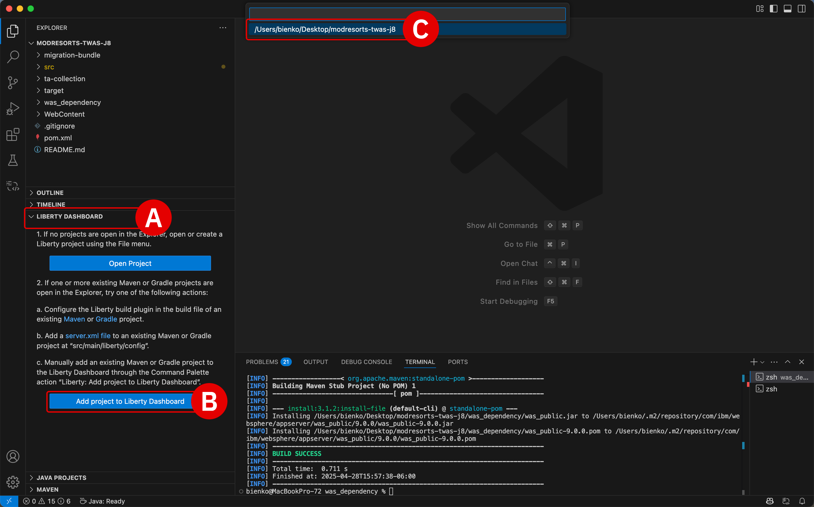
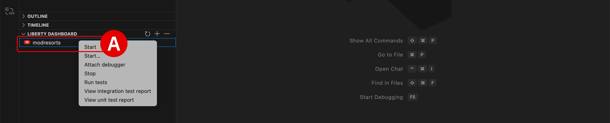
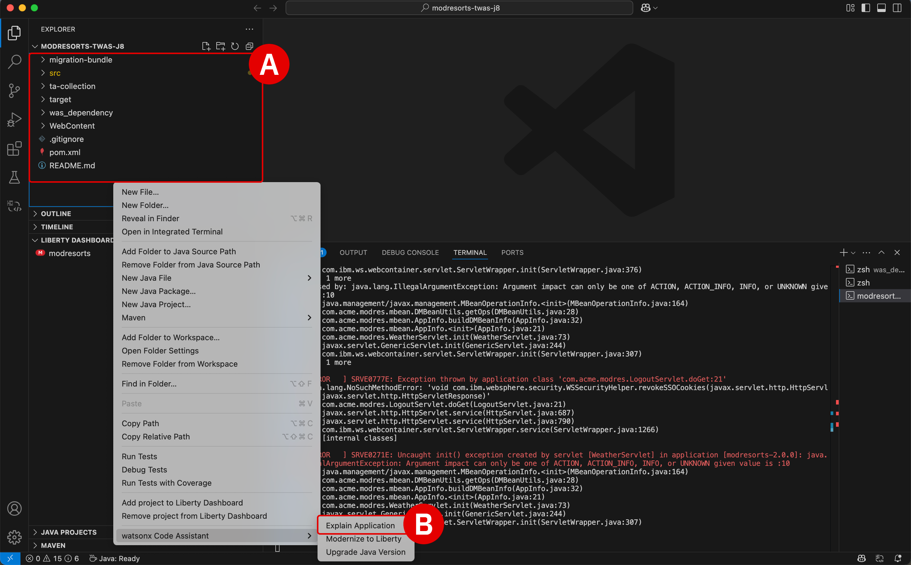
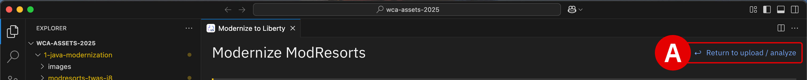
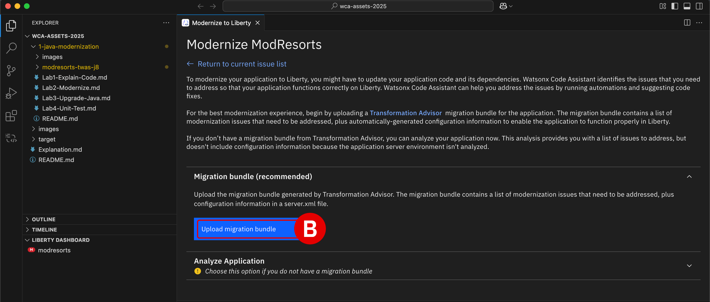
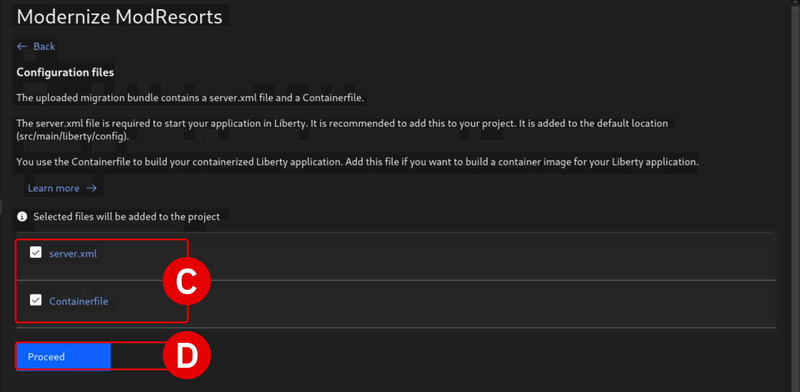
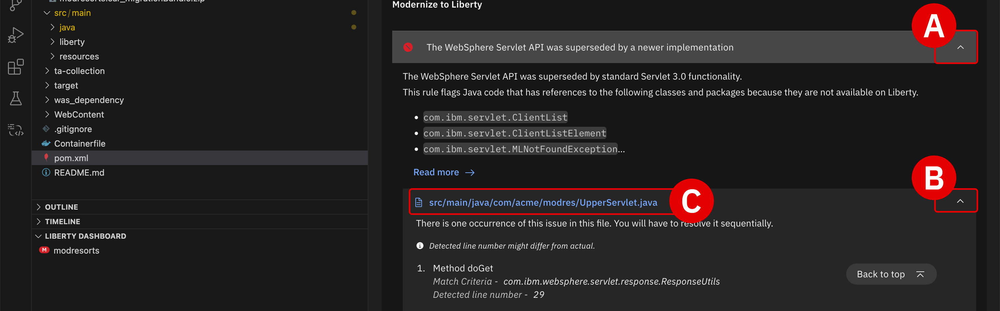
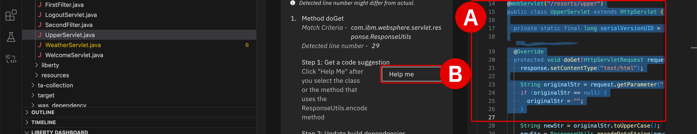

# **Full stack modernization**</br>*Modernizing WebSphere to Liberty*

## **i. Objectives**

As a capstone to the experimentation and feature-exploration conducted with **IBM watsonx Code Assistant** (**WCA**) in the previous modules of this chapter, participants will conclude the topic with a hands-on opportunity: modernization of a full-stack WebSphere Application Service (WAS) application into WebSphere Liberty.

Participants will be tasked with:

- Explaining the purpose of the legacy WAS code and detailing the necessary transformations
- Modernizing legacy packages and libraries from WAS to Liberty
- Upgrading Java versions from `Java 8` to `Java 21`
- Code recommendations will be generated using *WCA Chat*, as in the previous modules, alongside the *Modernize* and *Java Upgrade* capabilities built into WCA Standard plans

The culmination of this work will be a fully modernized and interactive web application that tangibly demonstrates the benefits of the techniques discussed throughout this chapter.

---

## **ii. Deploy the application**

Return to the Visual Studio Code (VS Code) application. It should already be signed in and authenticated with the WCA service on IBM Cloud.

---

1. Ensure that the **Explorer** tab is open to the `wca-assets-2025` directory.

    If not, it can be located within the `Documents` directory of the VM:
    
    ``` shell
    /Documents/wca-assets-2025/1-java-modernization/modresorts-twas-j8/
    ```

    ??? note "OPTIONAL: DOWNLOAD THE LAB ASSETS"
        Assets embedded within the lab virtual machine can be retrieved from the following repository.
        </br>
        **URL: [https://ibm.box.com/s/ps65ax6mupmwx3pww2b2ylvc9ed18njp](https://ibm.box.com/s/ps65ax6mupmwx3pww2b2ylvc9ed18njp)**
    
---

2. Open a **Terminal** within VS Code by clicking **Terminal** > **New Terminal** (from the top taskbar) or press ++ctrl++ + ++shift++ + ++tilde++ to open a console along the bottom of VS Code.

    </br>
    - Confirm the console is open to the correct directory (`/modresorts-twas-j8/` specifically) by executing the following command within the Terminal window:
    ``` shell
    cd ~/Documents/wca-assets-2025/1-java-modernization/modresorts-twas-j8/
    ```
    - Ensure the console is sourcing the correct `PATH` and `JAVA_HOME` environment variables by executing the following command within the Terminal window:
    ``` shell
    source ~/.zshrc
    ```

---

3. **Maven**, one of the several dependencies already pre-installed as part of the lab's virtualized environment, is a project management and build automation tool for Java-based applications. Before the WebSphere Application Server (WAS) application (`modresorts`) can be deployed, some additional steps must be undertaken to configure the Maven project. To do so, participants will need to finalize a `pom.xml` file (Project Object Model), compile the code, and deploy the build into a locally-hosted web application.

    </br>
    To produce the `target/modresorts-2.0.0.war` application build, as well as the necessary `pom.xml` file, **execute** the following instruction within the Terminal console:

    ``` shell
    mvn clean package -DskipTests
    ```

    </br>
    ??? note "OPTIONAL: DEPLOYING VIA PROGRAMMATIC vs. GRAPHICAL USER INTERFACE"
        Be aware that the instructions in Step 3 and 4 are a programmatic (console-driven) approach to building and deploying the Maven `modresorts` application. Alternatively, the same procedure can be conducted using Visual Studio Code's graphical user interface (GUI). Expand the tab below for details on how to perform this using the GUI.

        - Open the **Explorer** tab from the left-hand side of the VS Code interface
        - Below the list of assets belonging the `modresorts-twas-j8` directory, locate and toggle the **LIBERTY DASHBOARD**^[A]^ drop-down panel amongst the tabs
        - If `modresorts` is not displayed, click the **Add project to Liberty Dashboard**^[B]^ and press ++return++ when prompted to select the `modresorts-twas-j8` project^[C]^
        </br>
        
        - Right click on the `modresorts` project name to open the drop-down menu of options
        - Click **Start** to initialize the project
        </br>
        

---

4. With the `was_dependency` folder now prepared with the necessary drivers, the `modresorts` application is ready to *build* and *deploy* into a a live WebSphere Application Server-hosted website.

    </br>
    - **Execute** the following instruction set within the Terminal console:
    ``` shell
    mvn -f ~/Documents/wca-assets-2025/1-java-modernization/modresorts-twas-j8/pom.xml liberty:run -DcompileDependencies=false -DrecompileDependencies=false
    ```

    - VS Code will automatically download the necessary packages (you can trace the progress within the Terminal console)
    - **Wait** until the initialization process has finished and the console has returned a `Source compilation was successful` message
    - **Copy** and record the *Web application available (default host): ...* address returned by the Terminal console (`http://localhost:9080/resorts` or similar)

    !!! tip ""
        **Record** the value of the *Liberty Debug Port* to a notepad for reference later.

---

5. Open a new web browser tab and visit the **Web application URL** recorded in Step 4. Explore and familiarize yourself with the various tabs and pages built into the legacy web application.

    !!! note "ERRORS AND BROKEN WEB LINKS"
        As the legacy application has been built for WebSphere Application Server (WAS) using `Java 8`, but the deployment generated in Step 4 was intended for WebSphere Liberty using `Java 21`, there are a number of pages within the app that will produce an "Error" — for example, the location information module. These will be aspects of the application that you will remedy as part of the modernization steps that follow.

    </br>
    

---

## **iii. Explain the project code**

Let's better understand the entirety of the project by using the **explainability** features built into watsonx Code Assistant.

---

6. Open the **Explorer** tab from the left-hand interface to view the contents of the `modresorts-twas-j8` project
    
    - Right-click anywhere inside the `modresorts-twas-j8` workspace^[A]^ to open a drop-down menu of options
    - Hover over the **watsonx Code Assistant** option and then select **Explain Application**^[B]^
    - When prompted, click **Proceed with code analysis**
    - Wait **1-2 minutes** for the analysis to complete, at which time a pop-up will appear in the bottom-right corner of VS Code stating that `The explanation has been completed`
    - Click the **Open explanation** button within the pop-up to open and peruse the report

    !!! tip ""
        **Record** the entire output of the *Explain Application* report to a notepad for reference later.

    </br>
    

---

## **iv. Build a modernization plan**

Before modernizing the WAS application into Liberty, you'll need to scope out the necessary changes and level of effort required to do so. To obtain that understanding, you will need to generate a modernization plan using **<a href="https://www.ibm.com/products/cloud-pak-for-applications/transformation-advisor" target="_blank">IBM Cloud Transformation Advisor</a>**. For the purposes of this lab, one such plan has been prepared ahead of time and included within the `modresorts-twas-j8` project folder.

---

7. Open the **Explore** tab of VS Code and right-click anywhere inside the `modresorts-twas-j8` workspace. Then hover over **watsonx Code Assistant** and select **Modernize to Liberty**.

    - A *Modernize to Liberty* tab will open within the VS Code interface

    !!! note ""
        As the modernization plan prepared earlier by *IBM Cloud Transformation Advisor* has not yet been uploaded to WCA at this stage, the modernization recommendations proposed *currently* by the service are less granular and contextualized than they will be *after* uploading the migration bundle. This presents an interesting opportunity to compare the before and after impacts of the migration bundle on the WCA modernization plan.

    - To supply the migration bundle, click the **Return to Upload / analyze** button in the top-right corner of the *Modernize to Liberty* panel
    - Click the **Upload migration bundle** button
    - When prompted, specify `modresorts-twas-j8/migration-bundle/modresorts.ear_migrationBundle.zip` as the location of the migration bundle
    - Be sure that **BOTH** the `server.xml` and `Containerfile` assets are selected^[C]^
    - Finally, click **Proceed**^[D]^ to continue with the analysis

    !!! tip ""
        **Observe** the state of the *Selected files to be added to the project* before making any adjustments or selections. Record these observations to a notepad for reference later.
    
    </br>
    

    </br>
    

    </br>
    

---

8. Analysis will take a few moments to complete. When ready, the *Modernize* panel will generate a report that identifies issues with the application that need to be fixed. Some of these can be automatically repaired, while others will require a degree of manual intervention.

    - Under the **Issues** header, click the **Automated fixes** to pull open the list of issues that can be automated

    !!! tip ""
        **Inspect** each of the automated fix suggestions, including their titles and the contents within the expandable tabs. These details should be recorded to a notepad for reference later.

    - See more details about each by clicking the drop-down error to the right of the issue
    - Click the **Run automated fixes** button at the bottom of the page to execute the automated fixes to Liberty

    !!! tip ""
        **After** receiving a `BUILD SUCCESS` message from the console:
        
        - Record details about the *Estimate of time saved* included in the console read-out
        - Take note of how many Java source files were modified as a result of the automated fixes.
        
        Save this information to a notepad for reference later.
        
---

9. View details about the fix(es) requiring a degree of manual intervention by clicking the **Assisted fixes** tab.

    !!! tip ""
        **Record** the total number of *Assisted fixes*, *Self-directed fixes*, and *Additional information* suggestions to a notepad for future reference.

    - Along the top of the tab, left-click the grey **Instructions**^[A]^ panel to reveal the WCA-generated guidance on how to resolve the migration problems.
    - In this example, the `WebSphere Servlet API was superseded by a newer implementation` that uses `Servlet 3.0` functionality and as such a trio of packages used by the WAS app will no longer be available for use with Liberty
    - Further down the panel, impacted file(s) in the legacy application code will be provided
    - **Click**^[B]^ the drop-down arrow to the *right* of the impacted file to reveal a detailed set of instructions for how to improve the code
    - Afterwards, **click**^[C]^ the *name* of the impacted file to inspect its source code in a new editor window:
    
    ```
    src/main/java/com/acme/modres/UpperServlet.java
    ```

    </br>
    

---

10. An editor window will open on the right side of VS Code, displaying the contents of `UpperServlet.java` for editing. The next set of instructions will follow along with the guidance recommended by the *Modernize* panel (in the center of the VS Code interface):

    - **Select**^[A]^ all of the class that uses the `ResponseUtils.encodeDataString()` method, beginning on **Line 14** from `@WebServlet("/resorts/upper")` and ending on **Line 27** (an empty newline)

    !!! tip ""
        **Record** the text (if any) that appears directly above *Line 14* within the open `UpperServlet.java` file contents window. Save this information to a notepad for reference later.

    - With the relevant code selected, click the **Help me**^[B]^ button in the *Modernize* panel

    </br>
    

---

11. WCA will engage a *Chat* session and generate within the conversation **TWO** sets of code fixes that can be added to the legacy code in order to remedy the issue.

    </br>
    **Recommendation 1:** The first fix will be a *substitute* of the lines of code for `UpperServlet.java`, beginning on *Line 23* and ending on *Line 26*. A new line will also need to be added to the `import` statements at the beginning of the file.

    ``` java
    // Assisted by watsonx Code Assistant
    import org.apache.commons.text.StringEscapeUtils;

    @WebServlet("/resorts/upper")
    public class UpperServlet extends HttpServlet {
    
        private static final long serialVersionUID = 1L;
    
        @Override
        protected void doGet(HttpServletRequest request, HttpServletResponse response) throws ServletException, IOException {
            response.setContentType("text/html");
        
            String originalStr = request.getParameter("input");
            if (originalStr == null) {
                originalStr = "";
            }
        
            String escapedStr = StringEscapeUtils.escapeHtml4(originalStr);
            newStr = StringEscapeUtils.escapeHtml4(newStr);

            PrintWriter out = response.getWriter();
            out.print("<br/><b>capitalized input " + newStr + "</b>");
        }
    }
    ```

    </br>
    **Recommendation 2:** The second fix will be *new* lines of code that are to be added to the `pom.xml` file.

    ``` java
    <dependency>
        <groupId>org.apache.commons</groupId>
        <artifactId>commons-text</a>
        <version>1.12.0</version>
    </dependency>
    ```

---

12. Edit the contents of `UpperServlet.java` by **replacing** the highlighted lines of code as instructed in *Step 11* with the WCA-generated **Recommendation 1** code.

    Save the changes to the file (**File** > **Save**).

---

13. Locate the `pom.xml` file from the list of assets under the **Explorer** tab.

    - Double-click on the filename to edit the contents
    - Scroll down until you reach **Level 58** (`</dependency>`) and place your cursor at the end of the line, then hit ++return++ to create a new line
    - Beginning on the new **Line 59** of the `pom.xml` contents, **add** the contents of WCA's **Recommendation 2** (the second code block of *Step 11*) to the file
    - The new lines of code should now occupy Lines 59-63 of the modified `pom.xml` code
    - Ensure that the indentation lines up with other `<dependency>` declarations within the parent `<dependencies>` nesting
    - Save the changes to the file (**File** > **Save**)

---

14. With the application code now modified— by a combination of automated fixes and manual interventions —the original deployment launched in Step 2 will need to be re-deployed.

    - Return to the open VS Code **Terminal**
    - Press ++ctrl++ + ++c++ to terminate the application

    !!! tip ""
        **Record** the message returned by the console after terminating the application. Save this information to a notebook for reference later.

---

15. To re-deploy the application, return to the **Modernize** panel (right hand side). Take note of the fact that all *Issues* previously reported by the tool have been resolved.

    - Click the **Rebuild and refresh** button to re-deploy the modernized application
    - Wait for the *Modernize ModResorts* summary to refresh: it should now should only 1 Automated fix (optional and can be ignore) and 0 Assisted fixes are recommended
    - Open the **Explorer** tab and locate the **LIBERTY DASHBOARD** drop-down
    - Right click on `modresorts`, click **Start**, and wait for the console to report a successful deployment
    - **Refresh** the tab of the web application to inspect the modernized Liberty application
    - Previously broken features, such as the `Logout` button, should now be fully operable

    !!! tip ""
        **Click** the *Logout* button on the redeployed ModResorts page. Wait for the page to refresh and then **record** the message on the page to a notepad for reference later.

---

## **v. Java version upgrades**

Recall from before that the application's version of Java code was originally written for `Java 8`. However, to be compliant with modern versions of Liberty, that Java code will need to be upgraded to `Java 21`.

---

16. With the **Explorer** tab active, right click on the `modresorts-twas-j8` directory to expose a drop-down menu.

    - Hover over **watsonx Code Assistant**
    - Left click **Upgrade Java Version** to continue

---

17. A new *Upgrade* panel will open as a tab alongside the *Modernize* panel.

    - WCA will automatically detect that the code *Source* is designed for `IBM Java 8`
    - Set the *Target* parameter equal to `Java 21 (LTS)`
    - When ready, click the **Build and analyze** button

---

18. Similar to the *Modernize* steps previously, the *Upgrade* automation will generate a new **Issues** tab containing a list of potential fixes required before continuing with the Java version upgrade. Some of these tasks can be handled fully by automation; others will require some degree of manual intervention.

    - Select the **Automated fixes** tab first to identify three issues that can be resolved without human intervention
    - Click any of the recommended fixes to pull down additional information on what changes will be performed by the automation
    - When ready, click the **Run automated fixes** button to perform the tasks
    - Completion of the tasks may take several minutes to conclude

---

19. To examine the *Upgrade* tasks requiring human intervention, click the **Assisted fixes** tab.

    - Similarly to the *Modernization* panel, a description of the issue and detailed recommendations on how to perform the code fixes are listed within the tab
    - Click the name of the problematic file (`src/main/java/acme/modres/mbean/DMBeanUtils.java`) to open `DMBeanUtils.java` for editing and modification

---

20. According to WCA, there is an incompatibility with the `getOps` method within the `DMBeanUtils.java` codebase — specifically with the `MBeanOperationInfo` constructor that the method calls on line 28.

    - Click the **Help me** button to engage a new *WCA Chat* session
    - WCA will generate code recommendations within the *Chat* panel that can substitute the problematic legacy code
    - **Copy** the full `public final class DMBeanUtils {...}` code recommendation from the *Chat* panel to a clipboard
    - **Replace** the entire contents of the `DMBeanUtils.java` file with the recommendation from WCA
    - Save the changes to the file (**File** > **Save**)

---

21. There is a second *optional* recommendation available within the *Issues* tab of the **Upgrade** panel, but this can be safely **ignored** for now as it only relates to a deprecation warning.

---

22. With the application's Java version now upgraded to Java 21 by a combination of automated fixes and manual interventions —the application will once again need to be redeployed to reflect the changes.

    - Return to the open VS Code **Terminal**
    - Press ++ctrl++ + ++c++ to terminate the application

---

23. To re-deploy the application, return to the **Upgrade** panel (right hand side). Take note of the fact that all *Issues* previously reported by the tool have been resolved.

    - Click the **Rebuild and refresh** button to re-deploy the application
    - Wait for the Terminal to report a successful deployment
    - **Refresh** the tab of the web application to inspect the modernized Liberty application
    - Previously broken features, such as the `Location` module, should now be fully operable

---

## **vi. Conclusion**

Having concluded the **[Modernizing WebSphere to Liberty](https://ibm.github.io/wca-modernize/appmod/1/)** hands-on modules, those enrolled have the option to either continue to the *optional* **[IBM Cloud (SaaS) Configuration](https://ibm.github.io/wca-modernize/saas/1/)** chapter or to proceed to the final evaluation test for accreditation.