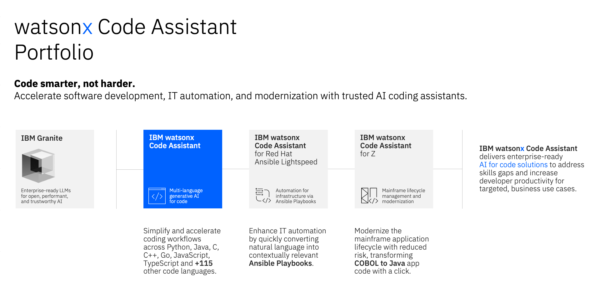
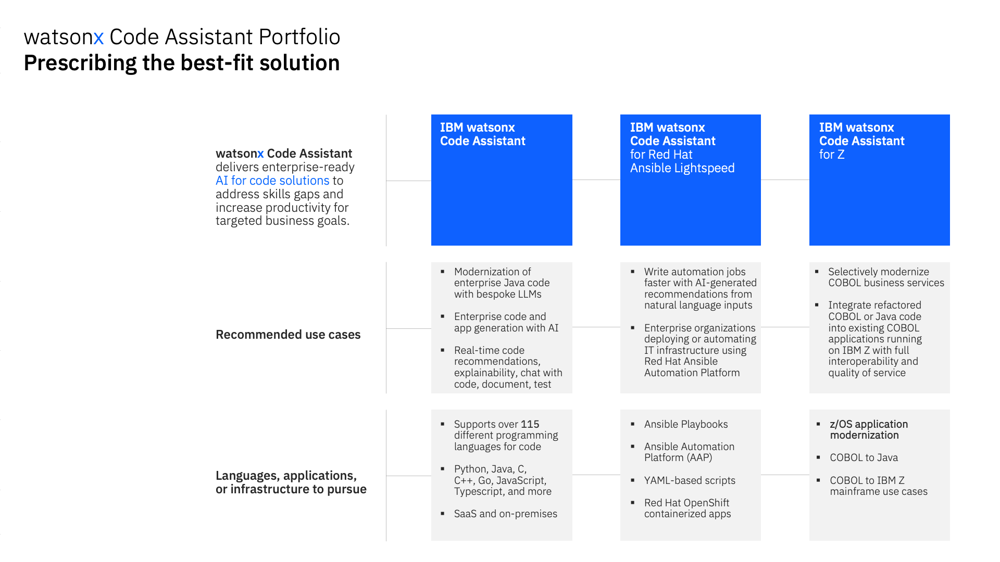

# **IBM watsonx Code Assistant** *Modernize Applications*

## **i. Introduction**

---

The curriculum of **IBM watsonx Code Assistant: Modernize Applications** is designed to teach IBM technical sellers and business partners on how to best plan, execute on, and deploy **IBM watsonx Code Assistant**. Level 4 learning plans assume that participants have the technical background and proficiency to demonstrate a product or solution to a client, as well as a deep level of understanding for how it can help the client achieve their business goals. Level 4 learning plans are the next logical learning step that goes beyond the demonstrations covered in the Level 3 learning. In keeping with the offering's hybrid cloud architecture, this will encompass deployments both on-premises and for Software-as-a-Service (SaaS) cloud.

The hands-on modules included within this GitHub documentation— and outlined in the section below —are part of a broader Level 4 curriculum hosted on *IBM YourLearning* and *IBM Training*. To view the curriculum in its entirety and receive full accreditation for completing the Level 4 material, visit the following links:

!!! warning ""
	**IBM YourLearning (IBMers):** <a href="https://yourlearning.ibm.com/activity/PLAN-5C0B3BB33307" target="_blank">https://yourlearning.ibm.com/activity/PLAN-5C0B3BB33307</a>
	
    **IBM Training (Business Partners):** <a href="https://www.ibm.com/training/learning-path/watsonx-code-assistant-level-4-1012" target="_blank">https://www.ibm.com/training/learning-path/watsonx-code-assistant-level-4-1012</a>

 
The "Practitioners" (Deploy) coursework extensively covers deployment of the service for both on-premises and IBM Cloud environments. Before taking this course, those enrolling should have earned the **<a href="https://www.credly.com/org/ibm/badge/watsonx-code-assistant-sales-foundation" target="_blank">watsonx Code Assistant Sales Foundation</a>** badge and the **<a href="https://www.credly.com/org/ibm/badge/watsonx-code-assistant-technical-sales-intermediate" target="_blank">watsonx Code Assistant Technical Sales Intermediate</a>** badge, and have the technical background and proficiency at giving hands-on demos to clients.

## **ii. WCA Portfolio**

---

**IBM watsonx Code Assistant** (**WCA**) is the flagship offering in a suite of generative AI (gen AI) code assistant products, which also include offerings for Ansible Automation Platform (via IBM watsonx Code Assistant for Red Hat Ansible Lightspeed) and IBM Z modernization (via IBM watsonx Code Assistant for Z).

The WCA portfolio accelerates Software Development Lifecycle (SDLC) tasks with AI-powered capabilities including context-aware code generation, explanation, documentation, translation, and unit test generation. It does so while maintaining the principles of trust, security, and compliance with regards to IBM client's data and intellectual property (IP).

---

---

WCA offerings are powered by IBM Granite foundation models that include state-of-the-art large language models (LLMs) designed for code. For offerings such as WCA for Ansible Lightspeed and WCA for Z, bespoke code models— tailored to working with Ansible Automation Platform and COBOL-to-Z use cases, respectively —are invoked. Universally true for all of the WCA offerings is that they are geared towards helping IT teams create high-quality code using AI-generated recommendations, based on natural language requests or existing source code. These AI models, and the recommendations they generate, are seamlessly integrated via extensions with the world's most popular integrated development environments (IDEs) – including Visual Studio Code and Eclipse.

 
!!! note "USE CASES TO PURSUE"
    The flagship offering, IBM watsonx Code Assistant is the premiere IBM technology for generating enterprise-grade code and applications using IBM Granite large language models (LLMs). It has a wide gamut of capabilities which will be covered in subsequent sections of this presentation. When prospecting clients, look out for use cases involving: real-time code recommendations; chat with code capabilities; code explainability; automated generation of code documentation; code testing and validation; as well as modernization of enterprise Java code.

    **IBM watsonx Code Assistant for Red Hat Ansible Lightspeed** (or "WCA for Ansible Lightspeed" in shorthand) allows clients to write automation jobs faster with AI-generated recommendations, using natural language prompts to instruct the solution on the types of automation jobs that require generation. Look out for use cases and opportunities with clients that involve enterprise organizations deploying (or automating) IT infrastructure with the Red Hat Ansible Automation Platform (AAP), which is a required enterprise license for using WCA for Ansible Lightspeed.

    **IBM watsonx Code Assistant for Z** (or "WCA for Z" in shorthand) is IBM's solution for selectively modernizing COBOL business services into Java applications running on IBM Z mainframe systems. Look out for client opportunities or use cases that involve integrating refactored COBOL (or Java) code into existing COBOL applications running on IBM Z, where it's critical that the full interoperability is maintained between environments and that quality of service is maintained.

 

The portfolio of solutions under the IBM watsonx Code Assistant family is expansive in terms of capabilities and the types of use cases that can be addressed. Aligning the best-fit solution to the appropriate use cases, languages, applications, and infrastructure is critical. Use the following guidelines to help shape client discussions and opportunities.

---

---

IBM watsonx Code Assistant supports over 115 different programming languages for code. In particular, languages and formats such as Java, C, JSON, JavaScript, HTML, and PHP are subjects in which WCA “Majors” and excels. Other languages such as Ruby, SQL, and Swift could be considered “Minors” where the generalized code model can work with the language, but has less training data to base those recommendations on. These percentages and training data volumes will continue to evolve as the Granite code models mature. WCA is also available via Software-as-a-Service (SaaS) consumption on cloud and deployable on-premises, which is a unique differentiator over other gen AI code solutions in the marketplace.

 
!!! note "LANGUAGES, APPLICATIONS, AND INFRASTRUCTURE TO PURSUE"
    For those familiar with other WCA offerings— such as IBM watsonx Code Assistant for Red Hat Ansible Lightspeed and IBM watsonx Code Assistant for Z —the generalized code model approach taken by WCA differs from the specialized code model approach of those two aforementioned offerings.

    The **WCA for Ansible Lightspeed** flavor of IBM Granite code models specializes (”Majors") only in Red Hat Ansible Playbooks and YAML (Yet Another Markup Language) formats. Similarly, the IBM Granite code model used by **WCA for Z** specializes in transforming COBOL mainframe code into modernized Java code for IBM Z systems. Ansible Playbooks and COBOL are supported (”Minor") languages for the generalized IBM Granite code models— and therefore are supported by WCA —but if a client wishes to specialize in those particular languages and frameworks, they would be well advised to utilize the bespoke **WCA for Ansible Lightspeed** and **WCA for Z** offerings to do so.

    For **WCA for Ansible Lightspeed**, hone in on opportunities involving: Ansible Playbooks, AAP environments, YAML-based automation scripts, and containerized applications running atop of Red Hat OpenShift.

    For **WCA for Z**, focus on opportunities involving: z/OS application modernization, COBOL to modernized Java transformations, and COBOL to IBM Z mainframe use cases.

## **iii. Curriculum**

---

The curriculum for the Level 4 hands-on labs is segmented across 3 chapters, each containing multiple modules that address topics of on-premises cluster deployments, configuration of Software-as-a-Service (SaaS) deployments on cloud, and modernization of legacy WebSphere Application Server code into WebSphere Liberty.

| CHAPTER | MODULES |
| - | - |
| <a href="https://ibm.github.io/wca-l4/on-premises/1/" target="_blank">**On-Premises Installation and Deployment**</a> | <a href="https://ibm.github.io/wca-l4/on-premises/1/" target="_blank">1. Objectives and requirements</a> <a href="https://ibm.github.io/wca-l4/on-premises/2/" target="_blank">2. Reserve an environment</a> <a href="https://ibm.github.io/wca-l4/on-premises/3/" target="_blank">3. Bastion host setup</a> <a href="https://ibm.github.io/wca-l4/on-premises/4/" target="_blank">4. Cluster preparation</a> <a href="https://ibm.github.io/wca-l4/on-premises/5/" target="_blank">5. Install prerequisite software</a> <a href="https://ibm.github.io/wca-l4/on-premises/6/" target="_blank">6. Install IBM Software Hub</a> <a href="https://ibm.github.io/wca-l4/on-premises/7/" target="_blank">7. Install IBM watsonx Code Assistant</a> |
| <a href="https://ibm.github.io/wca-l4/saas/1/" target="_blank">**IBM Cloud (SaaS) Configuration**</a> | <a href="https://ibm.github.io/wca-l4/saas/1/" target="_blank">1. Objectives and requirements</a> <a href="https://ibm.github.io/wca-l4/saas/2/" target="_blank">2. Reserve an environment</a> <a href="https://ibm.github.io/wca-l4/saas/3/" target="_blank">3. Configure the Java environment</a> <a href="https://ibm.github.io/wca-l4/saas/4/" target="_blank">4. Install VS Code extension</a> <a href="https://ibm.github.io/wca-l4/saas/5/" target="_blank">5. Install Eclipse plug-in</a> |
| <a href="https://ibm.github.io/wca-l4/appmod/1/" target="_blank">**Application Modernization - WebSphere to Liberty**</a> | <a href="https://ibm.github.io/wca-l4/appmod/1/" target="_blank">1. Objectives and requirements</a> <a href="https://ibm.github.io/wca-l4/appmod/2/" target="_blank">2. Basic migration capabilities</a> <a href="https://ibm.github.io/wca-l4/appmod/3/" target="_blank">3. Configuration management</a> <a href="https://ibm.github.io/wca-l4/appmod/4/" target="_blank">4. APIs and libraries</a> <a href="https://ibm.github.io/wca-l4/appmod/5/" target="_blank">5. EJB modernization</a> <a href="https://ibm.github.io/wca-l4/appmod/6/" target="_blank">6. JMS integration</a> <a href="https://ibm.github.io/wca-l4/appmod/7/" target="_blank">7. Security modernization</a> <a href="https://ibm.github.io/wca-l4/appmod/8/" target="_blank">8. Full stack modernization</a> |