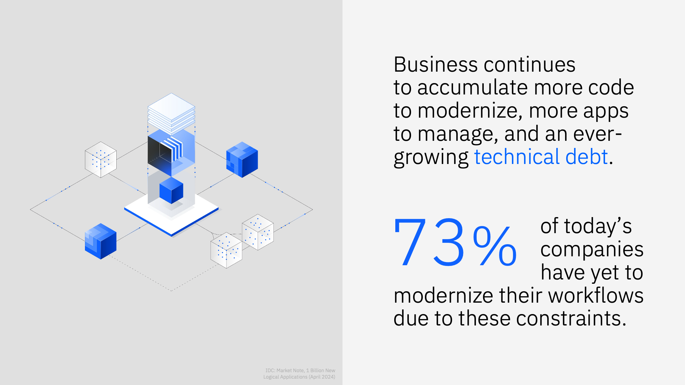

# **IBM watsonx Code Assistant** *Modernize Applications*

## **i. Disclaimer**

---

*© IBM Corporation 2025. All Rights Reserved.*

IBM’s statements regarding its plans, directions and intent are subject to change or withdrawal without notice at IBM’s sole discretion. Information regarding potential future products is intended to outline our general product direction and it should not be relied on in making a purchasing decision. The information mentioned regarding potential future products is not a commitment, promise, or legal obligation to deliver any material, code or functionality. Information about potential future products may not be incorporated into any contract. The development, release, and timing of any future features or functionality described for our products remains at our sole discretion.

References in this documentation to IBM products, programs, or services do not imply that they will be available in all countries in which IBM operates. Product release dates and/or capabilities referenced in this presentation may change at any time at IBM’s sole discretion based on market opportunities or other factors and are not intended to be a commitment to future product or feature availability in any way. Nothing contained in these materials is intended to, nor shall have the effect of, stating or implying that any activities undertaken by you will result in any specific sales, revenue growth, or other results. 

All client examples described are presented as illustrations of how those clients have used IBM products and the results they may have achieved. Actual environmental costs and performance characteristics may vary by client.

## **ii. Generative AI opportunity**

---

Two years ago, it would have been difficult to imagine the tremendous pace of development in domains like large language models (LLMs) and generative AI (gen AI). Ten years ago, these technologies were largely relegated to the areas of academic research and science fiction speculation. Today, they are propelling the next wave of productivity for businesses and their workforce.

Such rapid advances in so short a span of time are fueling ever-increasing excitement. As every industry and enterprise grapples with these changes, it's clear that gen AI brings new opportunities, poses new challenges, and necessitates innovation.

---

!!! note ""
    1. **Opportunity:** *4.4 trillion in productivity: Economic Potential of generative AI, McKinsey, June 2023*: [LINK](https://www.mckinsey.com/capabilities/mckinsey-digital/our-insights/the-economic-potential-of-generative-ai-the-next-productivity-frontier)
    2. **Challenges:** *2.4x annual increase in training costs: Cottier et al, The rising costs of training frontier AI models, May 2024*: [LINK](https://arxiv.org/abs/2405.21015)
    3. **Innovation:** *1/3 of interactions with Gen AI services will invoke action models or agents by 2028: Gartner press release, March 2024*: [LINK](https://www.gartner.com/en/newsroom/press-releases/2024-03-11-gartner-predicts-one-third-of-interactions-with-genai-services-will-use-action-models-and-autonomous-agents-for-task-completion-by-2028)

 
In terms of opportunity, McKinsey predicts that gen AI could add up to $4.4 trillion USD in value to global corporate profits annually. Doing so, however, will require business leaders to find the right answers to serious challenges: for example, how to mitigate the ballooning costs for training frontier AI models, which in 2025 is rising at a rate of 2.4X each year? In the face of these opportunities and challenges, humanity's innovative spirit is driving the greatest change: as AI advances from models, to assistants, to autonomous AI agents. In just a few years, Gartner predicts that one-third of all interactions with gen AI will be facilitated through the use of agents.

Combined, gen AI and application modernization fuel a virtuous cycle of increased agility and revenue growth. This dynamic blend has the power to enable a Chief Information Officer to greet key modernization challenges with unprecedented confidence.

---

!!! note ""
    1. **The CEO’s guide to generative AI and application modernization**: *IBM Institute for Business Value, 15 August 2023*: [LINK](https://www.ibm.com/thought-leadership/institute-business-value/en-us/report/ceo-generative-ai/application-modernization)
    
     
79% of responding executives to an IBM Institute for Business Value study said that using gen AI in application modernization projects will increase their overall business agility.

Integrating existing systems with modern applications creates perpetual challenges for an IT organization. Adapting and applying gen AI to tackle modernization challenges can help simplify the entire application modernization journey, accelerating how quickly businesses achieve these goals. Through gen AI-powered code conversion, code generation, code reverse engineering, and transformation planning, IBM clients have seen first-hand how they are able to address common modernization challenges, improve employee productivity, and reduce their costs.

---

!!! note ""
    1. **IDC**: *AI Coding Assistants for Application Modernization and IT Automation (March 2024)*
    2. **IDC**: *Market Note, 1 Billion New Logical Applications (April 2024)*: [LINK](https://www.idc.com/getdoc.jsp?containerId=US51953724)

When technical debt accumulates across various aspects of your IT infrastructure, such as code, architecture and documentation, identifying, prioritizing, and resolving the complexities can become a Herculean task. This is simply no longer the case with gen AI. When a company uses it to take on technical debt, they can accomplish tasks and achieve outcomes that were otherwise impossible. Enterprise-grade AI provides capabilities that improve issue classification, generate code for issue resolution and set up context-sensitive automation, significantly cutting down the time that developers spend fixing code.

With AI-enabled automation, developers can also reduce the time they spend provisioning cloud infrastructure, applying patches, and performing maintenance. From implementing faster code debugging and enabling better document generation to driving automation efforts, gen AI is designed to help reduce your technical debt and accelerate your modernization efforts one prompt at a time.

In the era of gen AI, executives and business leaders recognize the tremendous potential this technology has for modernizing their services, their ways of working with applications and data, and their workforce. According to International Data Corporation (IDC), 83% of these executives agree that modernization of cumbersome, legacy applications is central to remaining competitive in their marketplace, and therefore critical to their business strategy.

But while the vast majority of businesses recognize the imperative of modernizing applications and their workforce, only 27% of those companies have successfully modernized their workflows – leaving an untapped market of 73% that have yet to modernize such workflows. It turns out that changing patterns of work, IT culture, and the software development lifecycle are much more demanding tasks than anticipated. 

As these companies look to modernize legacy applications using gen AI, they are in parallel tapping into the technology’s tremendous potential to speed up delivery of new applications and rapidly churn out new code. The result has been a proliferation of net-new and ever-growing applications — which the IDC anticipates will exceed one billion new applications by 2028. The result of this will be more code bases that enterprise organizations need to maintain and modernize; more applications that they will need to support and secure; and ultimately, an ever-increasing amount of technical debt that these organizations will accrue.

To succeed, gen AI and coding assistants must be able to go beyond writing code — they need to support the entirety of code lifecycle management.

## **iii. WCA portfolio**

---

**IBM watsonx Code Assistant** is the flagship offering in a suite of gen AI code assistant products, which also include:

- **[IBM watsonx Code Assistant for Z](https://www.ibm.com/products/watsonx-code-assistant-z)** for IBM Z code modernization
- **[IBM watsonx Code Assistant for Red Hat Ansible Lightspeed](https://www.ibm.com/products/watsonx-code-assistant-ansible-lightspeed)** for Red Hat Ansible Automation Platform (AAP) and YAML-based Playbooks
- **[IBM watsonx Code Assistant for i](https://www.ibm.com/products/watsonx-code-assistant-for-i)** *coming soon in 2025* for RPG-based application code modernization

!!! note ""
    WCA offerings are powered by IBM Granite foundation models that include state-of-the-art LLMs designed for code. For offerings such as *WCA for Ansible Lightspeed* and *WCA for Z*, bespoke code models— tailored to working with Ansible Automation Platform and COBOL-to-Z use cases, respectively —are invoked.

 
The WCA portfolio accelerates Software Development Lifecycle (SDLC) tasks with AI-powered capabilities including context-aware code generation, explanation, documentation, translation, and unit test generation. It does so while maintaining the principles of trust, security, and compliance with regards to IBM client's data and intellectual property (IP).

Universally true for all of the WCA offerings is that they are geared towards helping IT teams create high-quality code using AI-generated recommendations, based on natural language requests or existing source code. These AI models, and the recommendations they generate, are seamlessly integrated via extensions with the world's most popular integrated development environments (IDEs) – including Visual Studio Code and Eclipse.

---

!!! note ""
    The portfolio of solutions under the *IBM watsonx Code Assistant* family is expansive in terms of capabilities and the types of use cases that can be addressed. Aligning the best-fit solution to the appropriate use cases, languages, applications, and infrastructure is critical for every business.

 

IBM watsonx Code Assistant supports over 115 different programming languages for code. In particular, languages and formats such as Java, C, JSON, JavaScript, HTML, and PHP are subjects in which WCA “Majors” and excels. Other languages such as Ruby, SQL, and Swift could be considered “Minors” where the generalized code model can work with the language, but has less training data to base those recommendations on. These percentages and training data volumes will continue to evolve as the Granite code models mature.

WCA is available via Software-as-a-Service (SaaS) consumption on cloud *and* deployable on-premises, which is a unique differentiator over other gen AI code solutions in the marketplace.

## **iv. Curriculum**

---

The core curriculum for this course is segmented across the *Application Modernization - WebSphere to Liberty* chapter — the details of which are outlined and hypedlinked below. It is recommended you start with the Objectives and Requirements module first, then work your way sequentially from there.

A second, **optional** chapter titled *IBM Cloud (SaaS) Configuration* has also been prepared for those who would like to replicate configuration of a WCA environment on their local machines. These configuration steps will enable you to authorize VS Code or Eclipse IDEs for use with IBM watsonx Code Assistant via extensions (or plug-ins), bypassing the need of working through a virtual machine. Instructions are available for doing so on both macOS and Windows operating system-based machines.

At the conclusion of the hands-on modules, participants will need to pass a final evaluation quiz to receive credit via IBM Training. Instructions for how to test-out with the quiz, and the criteria needed to pass, are available from the main IBM Training course page.

| CHAPTER | MODULES |
| - | - |
| <a href="https://ibm.github.io/wca-modernize/appmod/1/" target="_blank">**Application Modernization - WebSphere to Liberty**</a> | <a href="https://ibm.github.io/wca-modernize/appmod/1/" target="_blank">1. Objectives and requirements</a> <a href="https://ibm.github.io/wca-modernize/appmod/2/" target="_blank">2. Basic migration capabilities</a> <a href="https://ibm.github.io/wca-modernize/appmod/3/" target="_blank">3. Configuration management</a> <a href="https://ibm.github.io/wca-modernize/appmod/4/" target="_blank">4. APIs and libraries</a> <a href="https://ibm.github.io/wca-modernize/appmod/5/" target="_blank">5. EJB modernization</a> <a href="https://ibm.github.io/wca-l4/appmod/6/" target="_blank">6. JMS integration</a> <a href="https://ibm.github.io/wca-modernize/appmod/7/" target="_blank">7. Security modernization</a> <a href="https://ibm.github.io/wca-modernize/appmod/8/" target="_blank">8. Full stack modernization</a> |
| <a href="https://ibm.github.io/wca-modernize/saas/1/" target="_blank">**IBM Cloud (SaaS) Configuration**</a> | <a href="https://ibm.github.io/wca-modernize/saas/1/" target="_blank">1. Objectives and requirements</a> <a href="https://ibm.github.io/wca-modernize/saas/2/" target="_blank">2. Configure the Java environment</a> <a href="https://ibm.github.io/wca-modernize/saas/3/" target="_blank">3. Install VS Code extension</a> <a href="https://ibm.github.io/wca-modernize/saas/4/" target="_blank">4. Install Eclipse plug-in</a> |