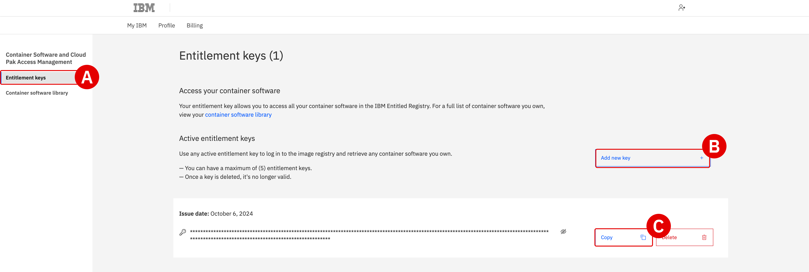

# **Objectives and requirements** *On-Premises Installation and Deployment*

## **i. About this lab**

The **On-Premises Installation and Deployment** module provides comprehensive instructions for how to prepare, configure, and deploy a simulated on-premises cluster for *IBM watsonx Code Assistant* (WCA) on environments hosted by *IBM Technology Zone* (ITZ).

By completing this module, participants will have learned and applied the skills necessary for deploying WCA on a client's on-premises infrastructure. The complete stack of technologies and services that you will deploy include:

- <a href="https://docs.redhat.com/en/documentation/openshift_container_platform/4.18" target="_blank">**Red Hat OpenShift Container Platform v4.18**</a>: a unified application development platform that lets clients build, modernize, and deploy applications at scale on their choice of hybrid cloud infrastructure.

- <a href="https://www.ibm.com/docs/en/cloud-paks/cp-data/5.1.x" target="_blank">**IBM Cloud Pak for Data v5.1.x**</a>: a set of services comprising a data fabric solution for data governance, data engineering, data analysis, and AI lifecycle tasks.

- <a href="https://www.ibm.com/docs/en/software-hub/5.1.x" target="_blank">**IBM Software Hub v5.1**</a>: a cloud-native solution that clients use to install, manage, and monitor IBM solutions on Red Hat OpenShift Container Platform (OCP).

- <a href="https://www.ibm.com/docs/en/wx-code-assistant/5.1.x" target="_blank">**IBM watsonx Code Assistant v5.1**</a>: a generative AI coding companion that provides contextually aware assistance for programming languages.

Special acknowledgement and thanks to IBM colleagues Coralie Jonvel, Nelson Nunes, and Noe Samaille for adaptation of their <a href="https://github.ibm.com/CESC-Infrastructure-Services/Installation-CP4D-WatsonX" target="_blank">**deployment instructions**</a> for watsonx.ai on Red Hat OpenShift.

---

!!! warning "GPUs NOT SUPPORTED FOR L4 ON-PREMISES DEPLOYMENTS"
    Resource and budget constraints for IBM Technology Zone and the IBM Enablement teams means that GPUs are **unavailable for the on-premises portion** of the Level 4 curriculum.
    
    The NVIDIA A100 or H100 GPUs required are simply too cost-prohibitive to be made available for individual IBMers and business partners. GPUs cannot be shared in a multi-tenant access pattern for IBM watsonx Code Assistant — and, as such, at minimum two cards would need to be made available for every L4 reservation. These costs are beyond the scope of what can be supported by this training.

    Participants ***will* have access to GPUs for the IBM Cloud (SaaS) portion** of the Level 4 curriculum.

---

## **ii. Infrastructure and resource requirements**

!!! note ""
    Requirements specific to the hands-on environment are outlined in the section below. Comprehensive details about the <a href="https://www.ibm.com/docs/en/software-hub/5.1.x?topic=requirements-x86-64-hardware#services" target="_blank">**hardware requirements for x86_64 cluster services**</a> are available from IBM Software Hub documentation.
    
Although the hands-on environment that will be provisioned in this module utilizes a templated, pre-defined ITZ infrastructure configuration, it will be useful for those enrolled to understand the resources required to reproduce a similar cluster in real-world client scenarios. This includes details about the CPU, memory, GPU, and other hardware components required to support the necessary cluster services.

 

**IBM Software Hub platform**
 Additional details available from <a href="https://www.ibm.com/docs/en/software-hub/5.1.x?topic=requirements-x86-64-hardware#platform" target="_blank">**IBM Documentation**</a>

| Node Role | Number of Services | Minimum Available vCPU | Minimum Memory | Minimum Storage |
| - | - | - | - | - |
| **Control plane** | 3 (for high availability) | 4 vCPU per node (This configuration supports up to 24 worker nodes.) | 16 GB RAM per node. This configuration supports up to 24 worker nodes. | No additional storage is needed for IBM Software Hub. |
| **Infra** | 3 (recommended) | 4 vCPU per node. This configuration supports up to 27 worker nodes. | 24 GB RAM per node (This configuration supports up to 27 worker nodes.) | See the Red Hat OpenShift Container Platform documentation for sizing guidance. |
| **Worker (compute)** | 3 or more worker (compute) nodes | 16 vCPU per node | **Minimum**: 64 GB RAM per node **Recommended**: 128 GB RAM per node | 300 GB of storage space per node for storing container images locally. If you plan to install watsonx.ai, increase the storage to 500 GB per node. |
| **Load balancer** | 2 load balancer nodes | 2 vCPU per node | 4 GB RAM per node. Add another 4 GB of RAM for access restrictions and security control. | Add 100 GB of root storage for access restrictions and security control. |

 

**IBM Cloud Pak Foundational Services**
 Additional details available from <a href="https://www.ibm.com/docs/en/software-hub/5.1.x?topic=requirements-x86-64-hardware#instance-prereq__cpfs__title__1" target="_blank">**IBM Documentation**</a>

| vCPU | Memory | Storage | Notes |
| - | - | - | - |
| 4 vCPU | 5 GB RAM | Reference the <a href="https://www.ibm.com/docs/SSRV9V_4.10/installer/hardware_sizing_reqs.html" target="_blank">**v4.10 hardware requirements and recommendations**</a>. | **Required.** IBM Cloud Pak Foundational Services are installed once for each instance of IBM Software Hub on the cluster. |

 

**Red Hat OpenShift Container Platform (single node)**
 Additional details available from <a href="https://www.ibm.com/docs/en/software-hub/5.1.x?topic=requirements-x86-64-hardware#platform__sno-reqs__title__1" target="_blank">**IBM Documentation**</a>

| VM Role | Minimum Available vCPU | Minimum Memory | Minimum Storage |
| - | - | - | - |
| **Bastion node** | 4 vCPU | 8 GB RAM | Allocate a minimum of 500 GB of disk space. The disk can be: in the same disk as the general bastion node storage; in a separate disk on the bastion node; or on external storage. |
| **Worker (compute)** | 16 vCPU | 64 GB RAM | Allocate a minimum of 300 GB of disk space on the node for image storage. |

 

**IBM watsonx Code Assistant**
 Additional details available from <a href="https://www.ibm.com/docs/en/software-hub/5.1.x?topic=requirements-x86-64-hardware#services__wxca__title__1" target="_blank">**IBM Documentation**</a>

| vCPU | Memory | Storage | Notes |
| - | - | - | - |
| **Operator pods:**  0.1 vCPU | **Operator pods:**  0.256 GB RAM | **Persistent storage:**  120 GB | Minimum resources for an installation with a single replica per service |
| **Catalog pods:**  0.01 vCPU | **Catalog pods:**  0.05 GB RAM | **Ephemeral storage:**  0.4 GB | The service requires at least two GPUs |
| **Operand:**  7 vCPU | **Operand:**  25 GB RAM | **Image storage:**  Up to 107 GB with all models | GPU support is limited to: NVIDIA H100 GPUs with 80 GB RAM |

## **iii. Prerequisites checklist**

---

**Register for an IBM Technology Zone account**

Participants require access to ITZ in order to reserve an environment and complete the hands-on work. If you do not yet have an account with the ITZ, you will need to <a href="https://techzone.ibm.com/" target="_blank">**register for one**</a>.

---

**Obtain an IBM Entitlement API key**

Participants require an entitlement API key to proceed with the on-premises installation. In order to retrieve the key:

1. Use your *IBMid* and *password* to **log in** to the <a href="https://myibm.ibm.com/products-services/containerlibrary" target="_blank">**Container Software Library**</a>.

2. Click the **Entitlement keys**^[A]^ tab from the navigation menu.

3. Click **Add new key**^[B]^ to generate a new entitlement key.

4. Select **Copy**^[C]^ to capture the entitlement key to the clipboard.

5. Paste and **save** the entitlement key to a text file on your local machine.

    {: loading=lazy width="400"}

---

## **iv. Troubleshooting and support**

If you require assistance or run into issues with the hands-on lab, help is available.

- **Environment issues:** The lab environment is managed by IBM Technology Zone. <a href="https://techzone.ibm.com/help" target="_blank">**Opening a support case ticket**</a> is recommended for issues related to the hands-on environment (provisioning, running, and so on.)

- **Product questions:** For questions related to IBM watsonx Code Assistant capabilities, sales opportunities, roadmap, and other such matters, open a thread on the <a href="https://ibm.enterprise.slack.com/archives/C059NKPUCP9" target="_blank">**#watsonx-code-assistant**</a> Slack channel.

---

## **v. Next steps**

In the following module, you will provision an OpenShift Container Platform cluster via IBM Technology Zone, which will serve as the basis for the on-premises environment.