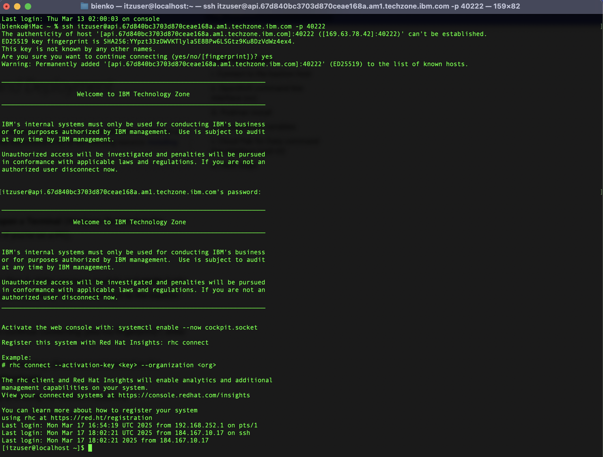
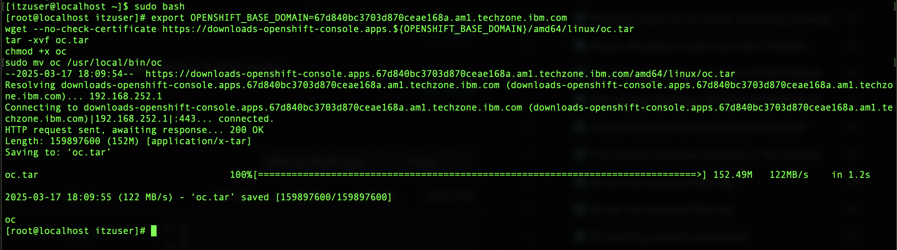
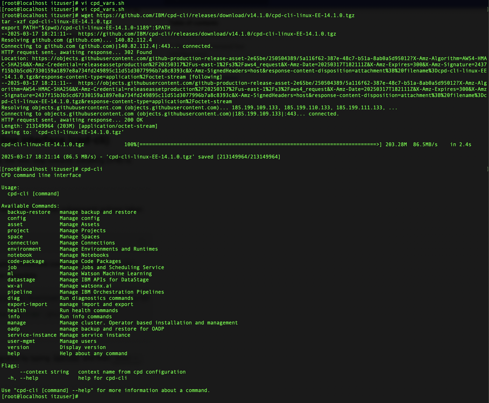
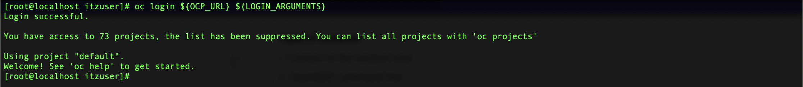

# **Bastion host setup**</br>*On-Premises Installation and Deployment*

!!! quote ""
    The following section is based off of IBM Documentation detailing how to install IBM Software Hub on a Red Hat OpenShift Container Platform cluster. Reference the instructions in full at the following resource: <a href="https://www.ibm.com/docs/en/software-hub/5.1.x?topic=workstation-installing-software-hub-cli" target="_blank">**Installing the IBM Software Hub command-line interface**</a>.

## **i. Connect to the bastion host**

To access and configure the bastion host node, **open a Terminal** (Windows Terminal or the Terminal built into VS Code are good alternatives if you're on a PC).

---

1. **Copy** the *Bastion SSH Connection* recorded in Step 6 of the previous module and **paste** it into the terminal console. Hit ++return++ to create an SSH connection to the bastion host.

    - When prompted *Are you sure you want to continue connecting (yes/no/fingerprint)?*, enter `yes` and hit ++return++ to proceed.

    - The console will return a *Welcome to IBM Technology Zone* once connected to the bastion host, at which point you must authenticate.

    - **Authenticate** when prompted to do so by providing the *Bastion Password*.

    - If the console now reads `[itzuser@localhost ~]$` then you have successfully accessed the bastion host.

    

---

## **ii. OpenShift command line interface (oc)**

Next, install the OpenShift Command Line Interface (CLI), designated `oc`, to programmatically perform work with the bastion node.

!!! note "ELEVATED PERMISSIONS"
        **Execute** the following command in the Terminal console to ensure that subsequent actions taken via the Terminal console are done with elevated permissions. This will save you needing to re-authenticate again for future commands.

        ``` shell
        sudo bash
        ```

---

2. Retrieve the *OCP Dashboard URL* (recorded in Step 6 of the previous module). Obtain the **OpenShift Base Domain** by extracting the portion of the URL that matches the position highlighted in the sample URL below. Extract the characters following `.apps.` up to and including `.com`. Do not include the `/dashboards` addendum.

    !!! note ""
        https://console-openshift-console.apps.**678a250b79141644e78804e0.ocp.techzone.ibm.com**

    - In this example, the value of the *OpenShift base domain* is `678a250b79141644e78804e0.ocp.techzone.ibm.com`

    - Record *your* OCP cluster's value to a notepad for future reference.

---

3. The following instruction set, when executed within a Terminal window, will install the OpenShift CLI on the bastion host node. However, the instructions require some modification before they will successfully execute.

    </br>
    **Install OpenShift CLI**
    ``` shell hl_lines="1"
    export OPENSHIFT_BASE_DOMAIN=<CHANGE_ME>
    wget --no-check-certificate https://downloads-openshift-console.apps.${OPENSHIFT_BASE_DOMAIN}/amd64/linux/oc.tar
    tar -xvf oc.tar
    chmod +x oc
    sudo mv oc /usr/local/bin/oc
    ```

    - Copy the instructions above and paste into a notepad.
    - Replace the highlighted `<CHANGE_ME>` text with the *OpenShift base domain* value recorded in Step 2.
    - Copy the modified notepad instructions to your clipboard and paste into your Terminal console.
    - Press ++return++ to execute the instructions.

    </br>
    

---

4. The setup should only take a moment to complete. Once finished, try typing `oc` into the console window and hit ++return++. The console output should verify that `oc` (the OpenShift CLI) has been successfully installed on the bastion host.

    </br>
    

---

## **iii. Podman install **

IBM Cloud Pak for Data (CP4D)'s installer requires containers, for which you will need to install Podman on the cluster nodes via the bastion host. 

---

5. Using the connected Terminal console, **execute** the following instruction to install Podman:

    ``` shell
    sudo yum install -y podman
    ```

    !!! warning ""
        The operation will take approximately **2 minutes** to complete. After a successful operation, the console will return the message `Complete!` alongside a summary of the installed components.

    

---

## **iv. Environment variables **

Set the environment variables needed for installation of CP4D on the cluster. The list is quite extensive and long, so rather than set these one at a time it's recommended that you first compile them into a single file on the bastion host. Afterwards, you can set all the variables automatically using the single file.

---

6. Below is a code block containing all of the necessary CP4D environment variables. **Copy** the contents of the entire block to your clipboard and **paste** into a notepad.

    </br>
    **CP4D Environment Variables**
    ``` shell linenums="1" hl_lines="19 23 49"
    #===============================================================================
    # Cloud Pak for Data installation variables
    #===============================================================================
    #------------------------------------------------------------------------------
    # Client workstation
    #------------------------------------------------------------------------------
    # Set the following variables if you want to override the default behavior of the Cloud Pak for Data CLI.
    #
    # To export these variables, you must uncomment each command in this section.
    #export CPD_CLI_MANAGE_WORKSPACE=<enter a fully qualified directory>
    # following lines could be used for environment with self-signed certificates and hostnames not resolved by DNS server
    #export OLM_UTILS_LAUNCH_ARGS="-v ./api-wxai.pem:/etc/k8scert --env K8S_AUTH_SSL_CA_CERT=/etc/k8scert --add-host oauth-openshift.apps.ocpinstall.gym.lan:192.168.252.4 --add-host api.ocpinstall.gym.lan:192.168.252.3"
    
    export PATH="/home/itzuser/cpd-cli-linux-EE-14.1.0-1189":$PATH

    #-----------------------------------------------------------------------------
    # Cluster
    #------------------------------------------------------------------------------
    export OCP_URL=api.<REPLACE THIS VALUE>:6443
    #export OPENSHIFT_TYPE=<enter your deployment type>
    #export IMAGE_ARCH=amd64
    export OCP_USERNAME=kubeadmin
    export OCP_PASSWORD=<REPLACE THIS VALUE>
    # export OCP_TOKEN=<enter your token>
    export SERVER_ARGUMENTS="--server=${OCP_URL}"
    export LOGIN_ARGUMENTS="--username=${OCP_USERNAME} --password=${OCP_PASSWORD}"
    # export LOGIN_ARGUMENTS="--token=${OCP_TOKEN}"
    export CPDM_OC_LOGIN="cpd-cli manage login-to-ocp ${SERVER_ARGUMENTS} ${LOGIN_ARGUMENTS}"

    export OC_LOGIN="oc login ${OCP_URL} ${LOGIN_ARGUMENTS}"

    #------------------------------------------------------------------------------
    # Projects
    #------------------------------------------------------------------------------
    export PROJECT_LICENSE_SERVICE=cpd-license
    export PROJECT_SCHEDULING_SERVICE=cpd-scheduling
    export PROJECT_CPD_INST_OPERATORS=cpd-operators
    export PROJECT_CPD_INST_OPERANDS=cpd-watsonx
    # export PROJECT_CPD_INSTANCE_TETHERED=<enter your tethered project>
    # export PROJECT_CPD_INSTANCE_TETHERED_LIST=<a comma-separated list of tethered projects>
    #------------------------------------------------------------------------------
    # Storage
    #------------------------------------------------------------------------------
    export STG_CLASS_BLOCK=ocs-storagecluster-ceph-rbd
    export STG_CLASS_FILE=ocs-storagecluster-cephfs
    #------------------------------------------------------------------------------
    # IBM Entitled Registry
    #------------------------------------------------------------------------------
    export IBM_ENTITLEMENT_KEY=<REPLACE THIS VALUE>
    #------------------------------------------------------------------------------
    # Cloud Pak for Data version
    #------------------------------------------------------------------------------
    export VERSION=5.1.0
    #------------------------------------------------------------------------------
    # Components
    #------------------------------------------------------------------------------

    #export COMPONENTS=ibm-cert-manager,ibm-licensing,scheduler,cpfs,cpd_plat-form
    # export COMPONENTS_TO_SKIP=<component-ID-1>,<component-ID-2>
    #export COMPONENTS=ibm-cert-manager,ibm-licensing,cpfs,scheduler,cpd_plat-form,wml,ws,watsonx_ai
    export COMPONENTS=cpd_platform,wca
    ```

---

7. You must make **modifications** to **Line 19**, **Line 23**, and **Line 49** of the *CP4D Environment Variables* to tailor the variables to *your* specific cluster.

    - **Line 19:** substitute the `<REPLACE THIS VALUE>` placeholder for `export OCP_URL=` with to the value of *OpenShift Base Domain* that was recorded in Step 2. **Do not replace the `.api.` or `:6443:` components**, as these are required. Your modified Line 19 should resemble the following:

        !!! note ""
            ``` shell
            export OCP_URL=api.678a250b79141644e78804e0.ocp.techzone.ibm.com:6443
            ```

    - **Line 23:** set the value of `export OCP_PASSWORD=` equal to the value of *Cluster Admin Password* recorded in Step 6 of the previous module. For example:

        !!! note ""
            ``` shell
            export OCP_PASSWORD=password1234
            ```

    - **Line 49:** set the value of `export IBM_ENTITLEMENT_KEY=` equal to the value of the key specific to *your* IBM account. Reference the *IBM Entitlement API Key* that was generated in the <a href="https://ibm.github.io/wca-l4/on-premises/1/#ii-infrastructure-and-resource-requirements" target="_blank">**iii. Prerequisites checklist section of Module 1 (Objectives and Requirements)**</a>. Instructions for how to generate an *IBM Entitlement API Key* are provided in that section. For example:

        !!! note ""
            ``` shell
            export IBM_ENTITLEMENT_KEY=verylongAPIkey1234
            ```

---

8. With a Terminal console, execute the following instruction to open the **vi** editor (or a different editor of your choosing) and create a shell script named `cpd_vars.sh` on the bastion host:

    ``` shell
    vi cpd_vars.sh
    ```

    - **Copy** the modified *CP4D Environment Variables* contents from the notepad (Step 7) to your machine's clipboard.

    - Switch back to the Terminal where the VI editor is now open and press the ++i++ key to enable inserting text.
    
    - Press ++cmd++ + ++v++ (or ++ctrl++ + ++v++) to paste the contents from your clipboard.

    - To save, press ++esc++ and then type `:wq` followed by ++return++ to write the file and exit the editor.

---

## **v. Cloud Pak for Data command line interface (cpd-cli) **

Now that the environment variables have been set, the next step towards installing CP4D is preparing the command line interface (`cpd-cli`). 

---

9. **Copy** the following code block and **execute** it within the console to install `cpd-cli`:

    ``` shell
    wget https://github.com/IBM/cpd-cli/releases/download/v14.1.0/cpd-cli-linux-EE-14.1.0.tgz
    tar -xzf cpd-cli-linux-EE-14.1.0.tgz
    export PATH="$(pwd)/cpd-cli-linux-EE-14.1.0-1189":$PATH
    ```

    !!! warning ""
        The operation will take approximately **1 minute** to complete.

---

10. **Verify** that the CLI has been successfully integrated with the following command:

    ``` shell
    cpd-cli
    ```
    
    The output from the console should resemble the screenshot below.

    

---

11. **Verify** the status of the restarted container by typing `podman ps` and ++return++, which should return the result of a single container running on the bastion host.

    ``` shell
    echo $PATH
    cpd-cli manage restart-container
    ```

    !!! warning ""
        The operation will take approximately **1 minute** to complete. After a successful operation, the console will return a pair of messages that resemble the following:

        ``` shell
        [SUCCESS] 2025-03-19T17:51:35.317974Z Successfully started the container <container_name>
        [SUCCESS] 2025-03-19T17:51:35.318017Z Container <container_name> has been re-created
        ```
    
    !!! tip ""
        **Record** the name of the restarted container to a notepad for reference later.

---

12. Source the newly-configured environment variables with the following command:

    ``` shell
    source cpd_vars.sh
    ```

---

13. Test that the login for `oc` command line is now functioning properly:

    ``` shell
    oc login ${OCP_URL} ${LOGIN_ARGUMENTS}
    ```

    The command line should return back with a prompt describing `You have access to ... projects` which indicates that `oc` and the environment variables have been configured.

    </br>
    

---

## **vi. Next steps **
        
At this stage the bastion host node has been fully configured ahead of installing the necessary software, which will be covered in the subsequent modules.

??? note "TROUBLESHOOTING: LOGGING IN AND SESSION TIMEOUTS"
    Be aware that SSH connections made over Terminal will time out after a long period of inactivity or due to a connection error. If you need to log back into the bastion terminal, follow the procedure below. Replace the `<BASTION_PWD>` placeholder with the password specific to *your* environment.

    1. Log back into the bastion node:

        ``` shell
        ssh itzuser@api.67828ca5e432cac47ccc4230.ocp.techzone.ibm.com -p 40222 <BASTION_PWD>
        ```
    
    2. Engage the `sudo` (privileged access) session:

        ``` shell
        sudo bash
        ```

    3. Source the environment variables stored in `cpd_vars.sh`:

        ``` shell
        source cpd_vars.sh
        ```

    4. Log back into OpenShift:

        ``` shell
        ${OC_LOGIN}
        ```

    5. Log back into `cpd-cli`:

        ``` shell
        ${CPDM_OC_LOGIN}
        ```