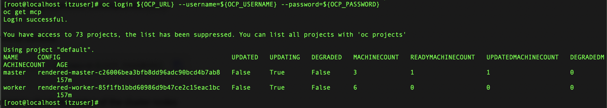

# **Cluster preparation**</br>*On-Premises Installation and Deployment*

!!! quote ""
    The following section is based off of IBM Documentation for preparing an OpenShift cluster for IBM Cloud Pak for Data. Reference the instructions in full at the following resource: <a href="https://www.ibm.com/docs/en/software-hub/5.1.x?topic=installing-preparing-your-cluster" target="_blank">**Preparing Your Cluster for IBM Software Hub**</a>.

## **i. Change process IDs limit**

With a newly installed cluster, a *KubeletConfig* will need to be manually created before the cluster's process IDs can be modified. This file will define the `podPidsLimit` and `maxPods` variables for the environment.

---

1. Copy the contents of the following code block and then **execute** within your Terminal console to generate a new *KubeletConfig* file:

    ``` shell
    oc apply -f - << EOF
    apiVersion: machineconfiguration.openshift.io/v1
    kind: KubeletConfig
    metadata:
      name: cpd-watsonx-kubeletconfig
    spec:
      kubeletConfig:
        podPidsLimit: 16384
        podsPerCore: 0
        maxPods: 500
      machineConfigPoolSelector:
        matchExpressions:
        - key: pools.operator.machineconfiguration.openshift.io/worker
          operator: Exists
    EOF
    ```

    !!! note "KUBELETCONFIG TEST"
        You can test whether a *KubeletConfig* file exists on the system by executing the following command:

        ``` shell
        oc get kubeletconfig
        ```

    !!! tip ""
        **Record** the output returned by the console and save this information to a notepad for reference later.

---

2. Use the CP4D command line (`cpd-cli`) to log into OCP by **executing** the following code:

    ``` shell
    cpd-cli manage login-to-ocp \
    --username=${OCP_USERNAME} \
    --password=${OCP_PASSWORD} \
    --server=${OCP_URL}
    ```

    !!! warning ""
        The operation will take approximately **1 minute** to complete. After a successful run, the console should return a pair of messages that resemble the following:
        
        ``` shell
        [SUCCESS] 2025-03-19T18:04:23.978349Z You may find output and logs in the /home/itzuser/cpd-cli-workspace/olm-utils-workspace/work directory.
        [SUCCESS] 2025-03-19T18:04:23.978412Z The login-to-ocp command ran successfully.
        ```

    </br>
    

---

## **ii. Update the cluster's global pull secret**

Use `cpd-cli` to manage the creation or updating of the global image pull *secret* via the `add-icr-cred-to-global-pull-secret` command.

---

3. **Execute** the following command within the Terminal console:

    ``` shell
    cpd-cli manage add-icr-cred-to-global-pull-secret --entitled_registry_key=${IBM_ENTITLEMENT_KEY} 
    ```

    The console will return two `[SUCCESS]` statements indicating a successful run.

    

---

4. Now you must update all nodes across the cluster using OpenShift command line (`oc`). **Execute** the following instructions via the Terminal console:

    ``` shell
    oc login ${OCP_URL} --username=${OCP_USERNAME} --password=${OCP_PASSWORD}
    oc get mcp
    ```

    Once completed, **execute** the following statement to check the status of the cluster nodes (this can be performed periodically to track the progress of the node updates):

    ``` shell
    cpd-cli manage oc get nodes
    ```

    Wait until the `STATUS` returns for all nodes (3 master nodes, 3 storage nodes, and 3 worker nodes) all report as `Ready`.

    </br>
    
    </br>
    

---

## **iii. Next steps**

In the following module, you will install the necessary prerequisite software required to deploy IBM Cloud Pak for Data and IBM watsonx Code Assistant.

??? note "TROUBLESHOOTING: LOGGING IN AND SESSION TIMEOUTS"
    Be aware that SSH connections made over Terminal will time out after a long period of inactivity or due to a connection error. If you need to log back into the bastion terminal, follow the procedure below. Replace the `<BASTION_PWD>` placeholder with the password specific to *your* environment.

    1. Log back into the bastion node:

        ``` shell
        ssh itzuser@api.67828ca5e432cac47ccc4230.ocp.techzone.ibm.com -p 40222 <BASTION_PWD>
        ```
    
    2. Engage the `sudo` (privileged access) session:

        ``` shell
        sudo bash
        ```

    3. Source the environment variables stored in `cpd_vars.sh`:

        ``` shell
        source cpd_vars.sh
        ```

    4. Log back into OpenShift:

        ``` shell
        ${OC_LOGIN}
        ```

    5. Log back into `cpd-cli`:

        ``` shell
        ${CPDM_OC_LOGIN}
        ```