# **Install prerequisite software**</br>*On-Premises Installation and Deployment*

!!! quote ""
    - Review the <a href="https://www.ibm.com/docs/en/software-hub/5.1.x?topic=cluster-installing-cert-manager-operator" target="_blank">**latest documentation on IBM Software Hub**</a> to determine the appropriate version needed for your client opportunity and OpenShift cluster version.
    - The following module <a href="https://docs.redhat.com/en/documentation/openshift_container_platform/4.16/html/security_and_compliance/cert-manager-operator-for-red-hat-openshift#cert-manager-operator-install" target="_blank">**follows the documentation**</a> for installing IBM Software Hub's `cert-manager-operator.v.13.0` for OpenShift Container Platform (OCP) v4.16.

## **i. Install the Red Hat OpenShift cert-manager**

After the release of **IBM Software Hub**, previous methods for installing IBM Cloud Pak for Data (CP4D) that relied on IBM Cert Manager are no longer required. IBM Software Hub is now the recommended path and will be the method adhered to in the following section.

---

1. First create the prerequisite project *namespace* by **executing** the following instruction:

    ``` shell
    oc new-project cert-manager-operator
    ```

    

---

2. Afterwards, return to your web browser and open the **OCP Dashboard** (<a href="https://ibm.github.io/wca-l4/on-premises/2/#ii-accessing-the-cluster" target="_blank">**Step 8 of Module 2**</a>).

    From the left-hand navigation menu, navigate to **Operators** > **OperatorHub**^[A]^.

    </br>
    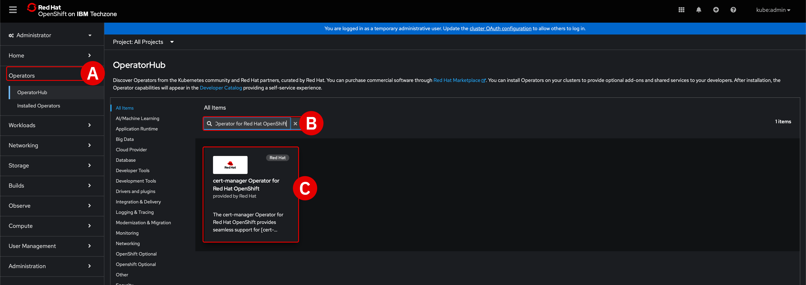

---

3. Into the filter box^[B]^, type `cert-manager Operator for Red Hat OpenShift` and **click**^[C]^ the filtered result with the same name.

---

4. From the configuration screen, select the following options:

    - *Channel*^[A]^ : `stable-v1.13`
    - *Version*^[B]^ : `1.13.0`
    - When ready, click the blue **Install**^[C]^ button

    </br>
    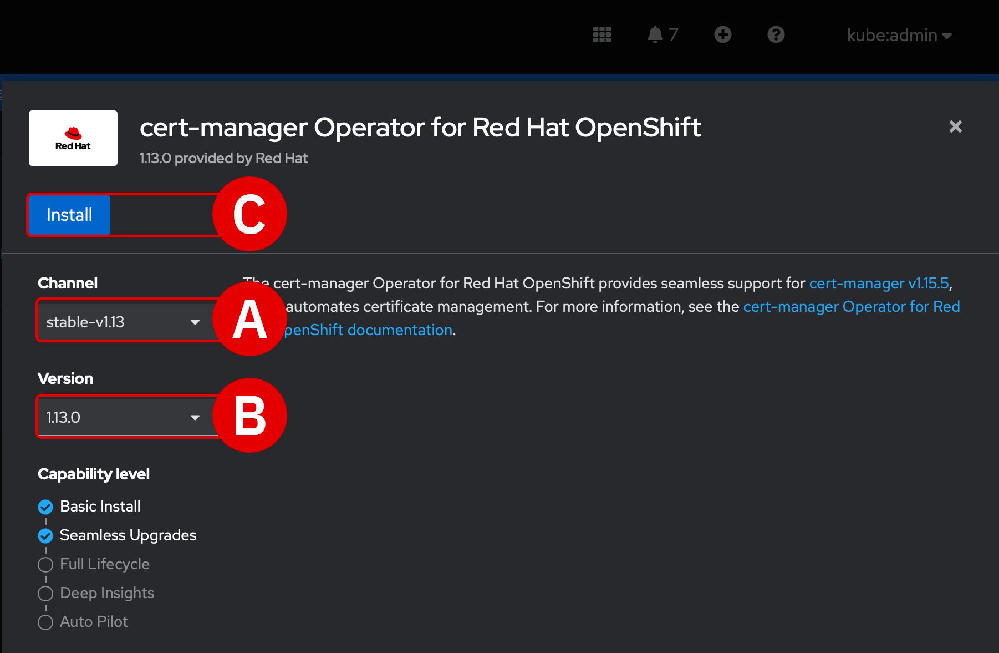{: loading=lazy width="400"}

---

5. A new page will load, summarizing the settings of the proposed Operator. Verify that the details are correct:
    - *Update channel*^[A]^ : `stable-v1.13`
    - *Version*^[B]^ : `1.13.0`
    - *Installation mode*^[C]^ : `A specific namespace on the cluster`
    - *Installed namespace*^[D]^ : `Operator recommended Namespace: cert-manager-operator`
    - *Update approval*^[E]^ : `Manual`
    
    </br>
    When ready, scroll down to the bottom of the page and click the blue **Install**^[F]^ button. The page will refresh periodically as the Operator is installed on the cluster. This may take several minutes to complete.
    
    - When prompted with a *Manual approval required* splashscreen, click **Approve**^[G]^
    - Wait until the page refreshes with the message *Installed operator: ready for use* and then click **View Operator**^[H]^ to view the finalized Operator

    </br>
    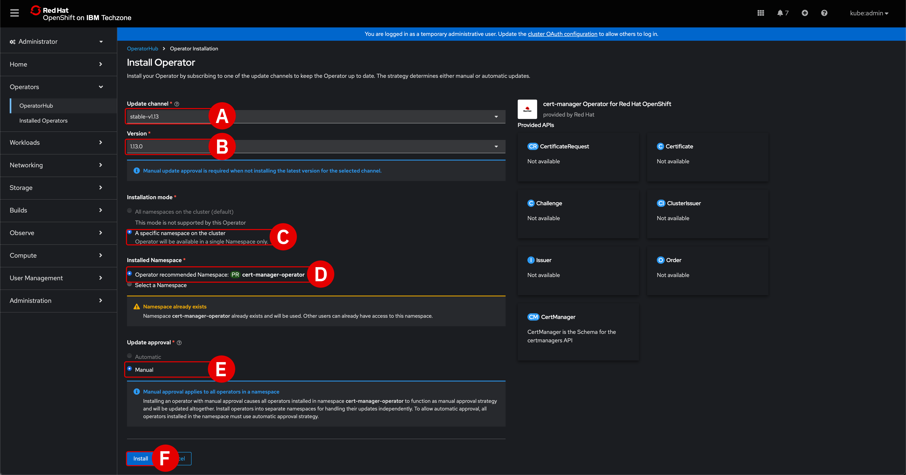
    </br>
    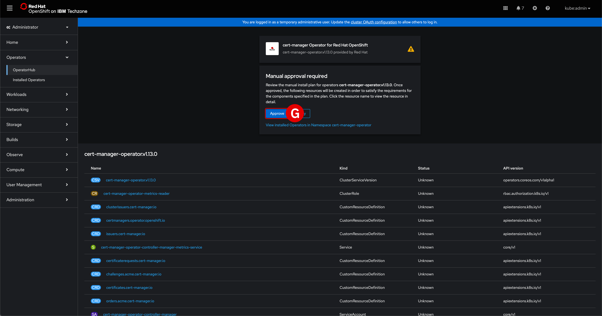
    </br>
    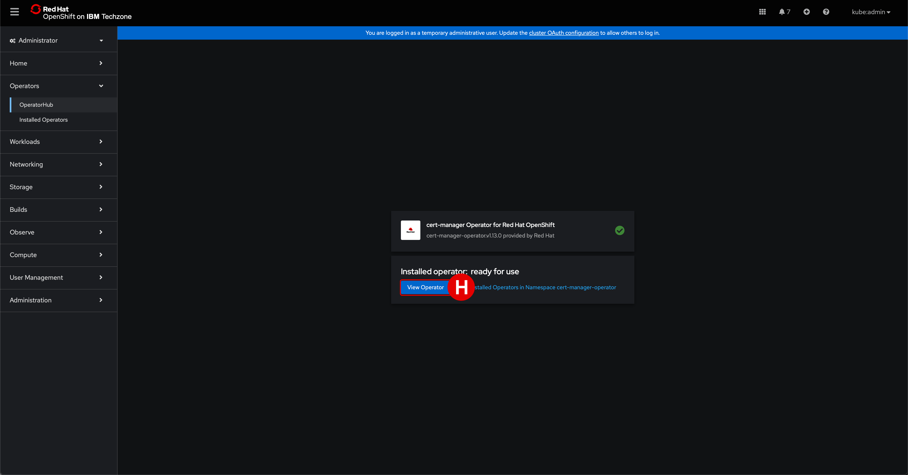

---

6. You can also track the progress of the Operator installation by drilling down into **Operators** > **Installed Operators** from the left-hand side of the OCP Dashboard. Scroll down until you locate the `cert-manager Operator for Red Hat OpenShift` entry in the table.

    </br>
    Monitor the progress by observing changes to the fourth column of the table. **Wait** until Operator shows a status of `Succeeded`.

---

7. On the OCP Dashboard, make sure you are under the **Operators** > **Installed Operators** view.
    - **Click** the title of the `cert-manager-Operator for Red Hat OpenShift` to open the details panel
    - From the tabs along the top of the page, click **Subscription**^[A]^
    - Under the *Subscription details* header, there are three panels: *Update channel*, *Update approval*, and *Update status*
    - Click the hyperlinked **1 requires approval**^[B]^ text next to the *Update Status* panel

    </br>
    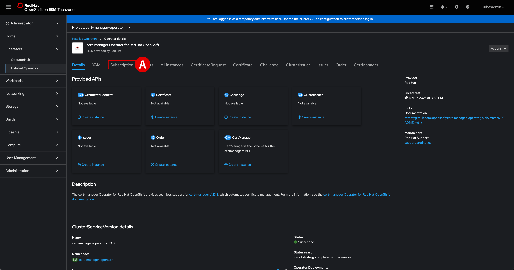
    </br>
    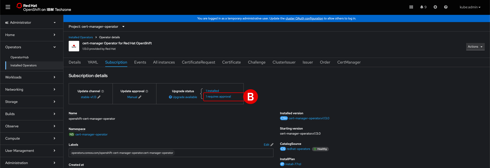

---

8. A new page, *InstallPlan details* for `install-12xyz`, will load.

    !!! note ""
        The string `12xyz` appended to `install-` is randomized. Your OCP *cert-manager* will have a unique name to the one in this example.

    - Click the blue **Preview InstallPlan**^[A]^ button
    - When the panel refreshes, click the blue **Approve** button to begin updating to `v1.13.1`
    - Wait for the status to the right of `install-12xyz` to read `Complete`^[B]^

    !!! tip ""
        After the status of the `install-12xyz` *InstallPlan* reads as `Complete`, the OCP dashboard will automatically refresh to display `cert-manager-operator.v1.13.1`'s multiple components and services. These can also be viewed again later by drilling down into **Operators** > **Installed Operators** > **cert-manager-operator.v1.13.1** from the left-hand interface.

        **Record** the *Name* of the component where the *Kind* value set to `ServiceAccount`. Save this information to a notepad for future reference.

    </br>
    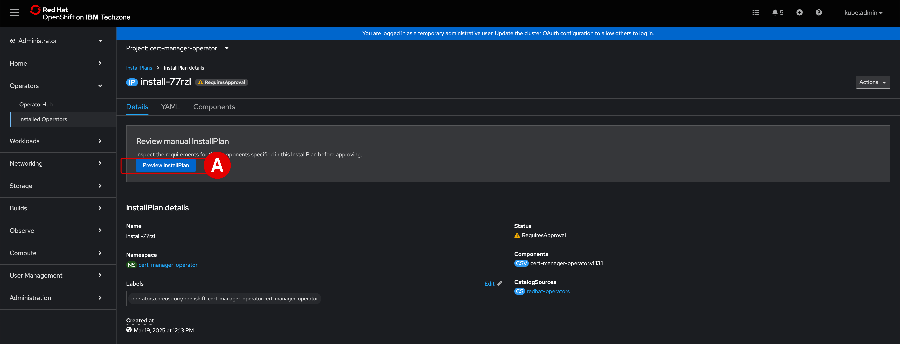
    </br>
    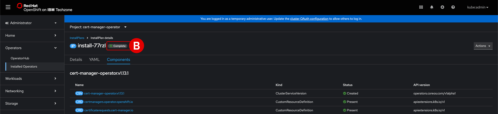

---

9. From the left-hand navigation bar of the OCP Dashboard, once again navigate into **Operators** > **Installed Operators** to watch the progress of the update. The `cert-manager Operator for Red Hat OpenShift` will show a *Status* of `Installing` while the update is underway. Wait until the status changes to `Succeeded`^[A]^.

    </br>
    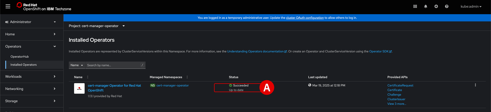

---

10. **Verify** that `cert-manager` pods are up and running by executing the following command with your Terminal console:

    ``` shell
    oc get pods -n cert-manager
    ```

    The console should return output closely resembling the following:

    ``` shell
    NAME                                       READY   STATUS    RESTARTS   AGE
    cert-manager-bd7fbb9fc-wvbbt               1/1     Running   0          3m39s
    cert-manager-cainjector-56cc5f9868-7g9z7   1/1     Running   0          4m5s
    cert-manager-webhook-d4f79d7f7-9dg9w       1/1     Running   0          4m9s
    ```

    At this point, the OpenShift `cert-manager` has been successfully deployed on the cluster.

    </br>
    

---

## **ii. Operators for GPUs**

!!! warning "GPUs NOT SUPPORTED FOR L4 ON-PREMISES DEPLOYMENTS"
    Resource and budget constraints for IBM Technology Zone and the IBM Enablement teams means that GPUs are **unavailable for the on-premises portion** of the Level 4 curriculum.
    
    The NVIDIA A100 or H100 GPUs required are simply too cost-prohibitive to be made available for individual IBMers and business partners. GPUs cannot be shared in a multi-tenant access pattern for IBM watsonx Code Assistant — and, as such, at minimum two cards would need to be made available for every L4 reservation. These costs are beyond the scope of what can be supported by this training.

    Participants ***will* have access to GPUs for the IBM Cloud (SaaS) portion** of the Level 4 curriculum.

</br>
Although GPUs will not be available to deploy or interact with for the *On-Premises Installation and Deployment* L4 training modules, participants will still be able to practice and learn the skills needed to prepare a cluster for GPUs.

This section will cover all of the necessary configuration and setup required to make GPUs available to an IBM watsonx Code Assitant service — shy of actually getting to use the GPUs with the on-premises deployment. Participants will still be able to interact with GPU-powered instances in the latter IBM Cloud (SaaS) modules of the L4 curriculum.

Services such as IBM watsonx Code Assistant (on-premises), which requires access to GPUs, need to install several Operators on the OpenShift cluster to support the management of NVIDIA software components. Those components, in turn, are needed to integrate the GPUs for access by the cluster.

IBM watsonx Code Assistant requires that the following Operators be installed:
- *Node Feature Discovery Operator*: within the `openshift-nfd` namespace
- *NVIDIA GPU Operator*: within the `nvidia-gpu-operator` namespace
- *Red Hat OpenShift AI*

---

## **iii. Install the Node Feature Discovery Operator**

!!! note ""
    The following section is based off a selection of the complete IBM Documentation available for <a href="https://www.ibm.com/docs/en/software-hub/5.1.x?topic=software-installing-operators-services-that-require-gpus" target="_blank">**Installing operators for services that require GPUs**</a>.

The following section will provide the instructions necessary to replicate the procedure of integrating NVIDIA GPUs with the OCP cluster. **Participants are welcome to practice this with the L4 environment provided** — just be aware that no physical GPU hardware will be available or connected at the conclusion of these steps.

---

11. Use a Terminal console to programmatically create a namespace `openshift-nfd` for the Node Feature Discovery (NDF) Operator. The following instruction set will create a namespace **Custom Resource** (CR) that defines the `openshift-ndf` namespace and then saves the YAML file to  `nfd-namespace.yaml`.

    Copy and paste the following code block into the Terminal console, then hit ++return++ :

    ``` shell
    oc apply -f - <<EOF 
    apiVersion: v1
    kind: Namespace
    metadata:
        name: openshift-nfd
        labels:
            name: openshift-nfd
            openshift.io/cluster-monitoring: "true"

    EOF
    ```

---

12. Install the **NDF Operator** within the `openshift-nfd` namespace that was created in Step 11 by defining the following objects. This will create an OperatorGroup CR and subsequently save the YAML file to `operatorgroup.yaml`.

    Copy and paste the following code block into the Terminal console, then hit ++return++ :

    ``` shell
    oc apply -f - <<EOF
    apiVersion: operators.coreos.com/v1
    kind: OperatorGroup
    metadata:
        generateName: openshift-nfd-
        name: openshift-nfd
        namespace: openshift-nfd
    spec:
        targetNamespaces:
        - openshift-nfd
    EOF
    ```

---

13. Create a **Subscription CR** and save the YAML file to `nfd-sub.yaml`.

    Copy and paste the following code block into the Terminal console, then hit ++return++ :

    ``` shell
    oc apply -f - <<EOF
    apiVersion: operators.coreos.com/v1alpha1
    kind: Subscription
    metadata:
        name: nfd
        namespace: openshift-nfd
    spec:
        channel: "stable"
        installPlanApproval: Automatic
        name: nfd
        source: redhat-operators
        sourceNamespace: openshift-marketplace
    EOF
    ```

---

14. Check on the **status** of the OpenShift pods with the following command:

    ``` shell
    oc get pods -n openshift-nfd
    ```

    !!! warning "TROUBLESHOOTING: No resources found in openshift-ndf namespace."
        Initially, the console may return a response such as `No resources found in openshift-ndf namespace.`</br>This likely is because the pod is still provisioning.
    
    <br/>
    Use the OCP Dashboard to **monitor** the progress of the pod deployments:

    - Return to the OCP Dashboard and navigate to **Operators** > **Installed Operators**^[A]^
    - Within the table, look for a resource named `nfd`^[B]^
    - If the code from Step 13 was only recently executed, the *Managed Namespaces* of this resource may be showing as `None` and the *Status* as `Unknown`^[C]^
    - Wait a few moments (and refresh the page if you wish) until the `nfd` resource is replaced by `Node Feature Discovery Operator`^[D]^, which should then belong to the `openshift-nfd` *Managed Namespace* and have a `Succeeded` *Status*^[E]^
    
    !!! warning ""
        This operation will take approximately **2 minutes** to complete. Wait and then **execute** the previous command from Step 14 a second time within the Terminal console. Observe the updated pod status. The console should report back the following to indicate that the Operator was successfully deployed:
        ``` shell
        NAME                                      READY   STATUS    RESTARTS   AGE
        nfd-controller-manager-7f4c4cf577-wn96r   2/2     Running   0          3m10s
        ```

    </br>
    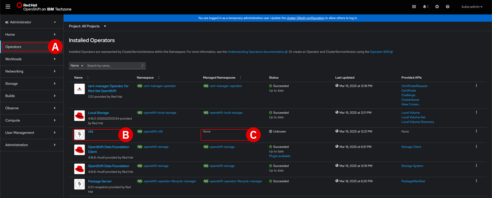
    </br>
    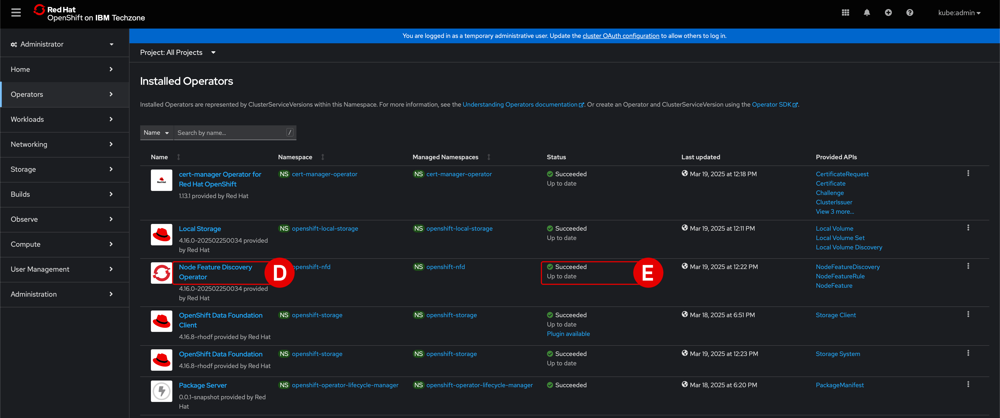

---

15. Create a **NodeFeatureDiscovery CR** and save the YAML file to `NodeFeatureDiscovery.yaml`.

    Copy and paste the following code block into the Terminal console, then hit ++return++ :

    ``` shell
    oc apply -f - <<EOF
    apiVersion: nfd.openshift.io/v1
    kind: NodeFeatureDiscovery
    metadata:
        name: nfd-instance
        namespace: openshift-nfd
    spec:
        instance: "" # instance is empty by default
        operand:
            image: registry.redhat.io/openshift4/ose-node-feature-discovery-rhel9:v4.16 
            imagePullPolicy: Always
        workerConfig:
            configData: |
                core:
                #  labelWhiteList:
                #  noPublish: false
                    sleepInterval: 60s
                #  sources: [all]
                #  klog:
                #    addDirHeader: false
                #    alsologtostderr: false
                #    logBacktraceAt:
                #    logtostderr: true
                #    skipHeaders: false
                #    stderrthreshold: 2
                #    v: 0
                #    vmodule:
                ##   NOTE: the following options are not dynamically run-time configurable
                ##         and require a nfd-worker restart to take effect after being changed
                #    logDir:
                #    logFile:
                #    logFileMaxSize: 1800
                #    skipLogHeaders: false
                sources:
                    cpu:
                        cpuid:
                            # NOTE: whitelist has priority over blacklist
                            attributeBlacklist:
                                - "BMI1"
                                - "BMI2"
                                - "CLMUL"
                                - "CMOV"
                                - "CX16"
                                - "ERMS"
                                - "F16C"
                                - "HTT"
                                - "LZCNT"
                                - "MMX"
                                - "MMXEXT"
                                - "NX"
                                - "POPCNT"
                                - "RDRAND"
                                - "RDSEED"
                                - "RDTSCP"
                                - "SGX"
                                - "SSE"
                                - "SSE2"
                                - "SSE3"
                                - "SSE4.1"
                                - "SSE4.2"
                                - "SSSE3"
                            attributeWhitelist:
                        kernel:
                            kconfigFile: "/path/to/kconfig"
                            configOpts:
                                - "NO_HZ"
                                - "X86"
                                - "DMI"
                        pci:
                            deviceClassWhitelist:
                                - "0200"
                                - "03"
                                - "12"
                            deviceLabelFields:           
                                - "class"
                                - "vendor"
    EOF
    ```

---

16. As before, check on the **status** of the OpenShift pods with the following command:

    ``` shell
    oc get pods -n openshift-nfd
    ```

    !!! warning ""
        This operation will take approximately **1 minutes** to complete. Wait until all pods return a status of `Running` before continuing to Step 17.

    

---

## **iv. Install the NVIDIA GPU Operator**

!!! note ""
    The following section is based off a selection of the complete NVIDIA Corporation documentation for <a href="https://docs.nvidia.com/datacenter/cloud-native/openshift/24.9.1/install-gpu-ocp.html" target="_blank">**Installing the NVIDIA GPU Operator on OpenShift**</a>.

---

17. **Create** the `nvidia-gpu-operator` namespace by executing the following code block with a Terminal console:

    ``` shell
    oc apply -f - <<EOF
    apiVersion: v1
    kind: Namespace
    metadata:
        name: nvidia-gpu-operator
    EOF
    ```

---

18. Define the **OperatorGroup** within the same namespace:

    ``` shell
    oc apply -f - <<EOF
    apiVersion: operators.coreos.com/v1
    kind: OperatorGroup
    metadata:
        name: nvidia-gpu-operator-group
        namespace: nvidia-gpu-operator
    spec:
        targetNamespaces:
        - nvidia-gpu-operator
    EOF
    ```

---

19. **Execute** the following code block within a Terminal console to get the channel version (required for Step 20), as well as create the `gpu-operator-certified` Operator within the `nvidia-gpu-operator` namespace:

    ``` shell
    export CHANNEL=$( oc get packagemanifest gpu-operator-certified -n openshift-marketplace -o jsonpath='{.status.defaultChannel}' ; echo)

    export CURRENT_CSV=$( oc get packagemanifests/gpu-operator-certified -n openshift-marketplace -ojson | jq -r '.status.channels[] | select(.name == "'$CHANNEL'") | .currentCSV' ; echo)

    oc apply -f - <<EOF
    apiVersion: operators.coreos.com/v1alpha1
    kind: Subscription
    metadata:
        name: gpu-operator-certified
        namespace: nvidia-gpu-operator
    spec:
        channel: "${CHANNEL}"
        installPlanApproval: Manual
        name: gpu-operator-certified
        source: certified-operators
        sourceNamespace: openshift-marketplace
        startingCSV: "${CURRENT_CSV}"
    EOF
    ```

---

20. **Execute** the following command to verify the status of the install plan:

    ``` shell
    oc get installplan -n nvidia-gpu-operator
    ```

    !!! warning "TROUBLESHOOTING: No resources found in nvidia-gpu-operator namespace."
        The `nvidia-gpu-operator` namespace is still being deployed.</br>**Wait** for 1 minute and then try executing *Step 20* again.

    </br>
    The console will return a statement that Operator's *APPROVAL* status is currently set to `Manual` and incomplete (*APPROVED* state is set to `false`).

    ``` shell
    NAME            CSV                              APPROVAL   APPROVED
    install-4rq4j   gpu-operator-certified.v24.9.2   Manual     false
    ```

    </br>
    Therefore, you will need to approve the install plan by **executing** the following command:

    ``` shell
    export INSTALL_PLAN=$(oc get installplan -n nvidia-gpu-operator -oname)
    oc patch $INSTALL_PLAN -n nvidia-gpu-operator --type merge --patch '{"spec":{"approved":true }}'
    ```

    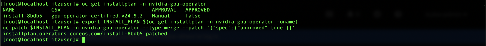

    </br>
    Return to the OCP Dashboard and drill down into **Operators** > **Installed Operators** to monitor the progress of the update. Wait until the `NVIDIA GPU Operator`^[A]^ appears in the table with *Status* set to `Succeeded` before continuing.

    </br>
    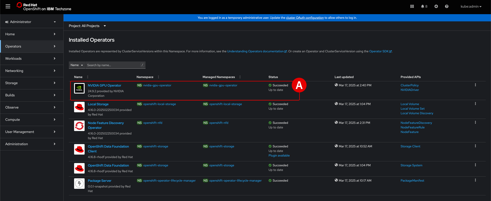

---

21. Create a **ClusterPolicy** by executing the following instructions:

    ``` shell
    oc get csv -n nvidia-gpu-operator ${CURRENT_CSV} -ojsonpath={.metadata.annotations.alm-examples} | jq .[0] > clusterpolicy.json
    oc apply -f clusterpolicy.json
    ```

    !!! tip ""
        **Record** the status message returned by the console to a notepad for reference later.

---

22. Check the status of the pods. If GPUs are detected within the cluster, they will be included in the read-out. As the Level 4 demonstration environment is not equipped with GPU hardware, no GPU resources will be discovered by the `oc get` command.

    **Execute** the following command with the Terminal console:

    ``` shell
    oc get pods -n nvidia-gpu-operator
    ```

---

## **v. Install Red Hat OpenShift AI**

!!! note ""
    The following steps are extracted from the complete documentation available from IBM Documentation for <a href="https://www.ibm.com/docs/en/software-hub/5.1.x?topic=software-installing-red-hat-openshift-ai" target="_blank">**Installing Red Hat OpenShift AI**</a>.

IBM watsonx Code Assistant (on-premises) requires installation and configuration of **Red Hat OpenShift AI** on the OCP cluster. In the following section, you will:

- Install the Operator for Red Hat OpenShift AI (v2.13)
- Create a *DSCInitialization* instance
- Create a *DataScienceCluster* instance
- Edit the model inferencing configuration

---

23. Create the `redhat-ods-operator` **Project** on the OCP cluster with the following command:

    ``` shell
    oc new-project redhat-ods-operator
    ```

---

24. Define the `rhods-operator` **Operator Group** within the project defined in Step 23:

    ``` shell
    cat <<EOF |oc apply -f -
    apiVersion: operators.coreos.com/v1
    kind: OperatorGroup
    metadata:
        name: rhods-operator
        namespace: redhat-ods-operator
    EOF
    ```

---

25. Create the **Operator Subscription** for `rhods-operator` within the same project:

    ``` shell
    cat <<EOF |oc apply -f -
    apiVersion: operators.coreos.com/v1alpha1
    kind: Subscription
    metadata:
        name: rhods-operator
        namespace: redhat-ods-operator
    spec:
        name: rhods-operator
        channel: stable-2.13
        source: redhat-operators
        sourceNamespace: openshift-marketplace
        config:
            env:
                - name: "DISABLE_DSC_CONFIG"
    EOF
    ```

    !!! warning ""
        This operation will take approximately **5 minutes** to complete. Return to the OCP Dashboard and drill down into **Operators** > **Installed Operators** to monitor the progress of the *Red Hat OpenShift AI*^[A]^ Operator deployment.

    </br>
    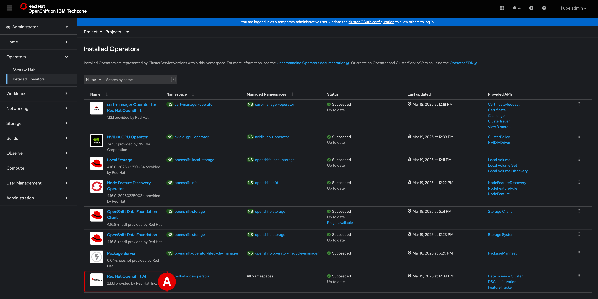

---

26. Create a **DSCInitialization** object `default-dsci` in `redhat-ods-monitoring` project:

    ``` shell
    cat <<EOF |oc apply -f -
    apiVersion: dscinitialization.opendatahub.io/v1
    kind: DSCInitialization
    metadata:
        name: default-dsci
    spec:
        applicationsNamespace: redhat-ods-applications
        monitoring:
            managementState: Managed
            namespace: redhat-ods-monitoring
        serviceMesh:
            managementState: Removed
        trustedCABundle:
            managementState: Managed
            customCABundle: ""
    EOF
    ```

    </br>
    **Monitor** the progress of the *DSCInitialization* object by executing the following command:

    ``` shell
    oc get dscinitialization
    ```

    !!! warning ""
        This operation will take approximately **2 minutes** to complete. **Wait** for the *DSCInitialization* object (`dscinitialization`) to return a `Ready` status before continuing on to Step 27.

---

27. Create a **DataScienceCluster** object named `default-dsc` within the same project:

    ``` shell
    cat <<EOF |oc apply -f -
    apiVersion: datasciencecluster.opendatahub.io/v1
    kind: DataScienceCluster
    metadata:
        name: default-dsc
    spec:
        components:
            codeflare:
                managementState: Removed
            dashboard:
                managementState: Removed
            datasciencepipelines:
                managementState: Removed
            kserve:
                managementState: Managed
                defaultDeploymentMode: RawDeployment
                serving:
                    managementState: Removed
                    name: knative-serving
            kueue:
                managementState: Removed
            modelmeshserving:
                managementState: Removed
            ray:
                managementState: Removed
            trainingoperator:
                managementState: Managed
            trustyai:
                managementState: Removed
            workbenches:
                managementState: Removed
    EOF
    ```

    </br>
    The *Red Hat OpenShift AI Operator* automatically installs and manages services that are listed as `Managed`. Services with a status of `Removed` are ignored and will not be installed.

    !!! warning ""
        This operation will take approximately **2-3 minutes** to complete.

---

28. **Execute** the following instruction to check the status of pods within the `redhat-ods-applications` project:

    ``` shell
    oc get pods -n redhat-ods-applications
    ```

    !!! warning ""
        If no pods are detected, wait an additional **3 minutes** and try again. Confirm that **ALL FIVE** of the following pods are deployed with a `Running` status before continuing to *Step 29*.
        ``` shell
        NAME                                          READY   STATUS    RESTARTS   AGE
        kserve-controller-manager-7b745757cb-wx7qc    1/1     Running   0          42s
        kubeflow-<REDACTED>-659b5dcb99-5t8vt          1/1     Running   0          56s
        odh-model-controller-b774fb859-2b4b4          1/1     Running   0          117s
        odh-model-controller-b774fb859-4gxhv          1/1     Running   0          117s
        odh-model-controller-b774fb859-fpnrl          1/1     Running   0          117s
        ```

    !!! tip ""
        **Record** the full name of the `kubeflow-...` pod to a notepad for reference later.

---

29. Edit the `inferenceservice-config` configuration map within the `redhat-ods-applications` project. This is best achieved by using the OCP Dashboard via a web browser.

    - From the OCP Dashboard, navigate into **Workloads** > **Configmaps**^[A]^
    - From the *Project*^[B]^ drop-down list, select `redhat-ods-applications`^[C]^
    - Click the `inferenceservice-config` resource^[D]^ and open the **YAML** tab^[E]^
    - In the `metadata.annotations` section^[F]^ (Lines 4-5) of the file, add a new Line 8^[G]^ which reads `opendatahub.io/managed: 'false'` 
    - **Do not** save the changes yet (there are more changes in *Step 30* to perform before saving the YAML file)
    - The resulting YAML file should resemble the following:

    ``` yaml hl_lines="6"
    metadata:
    annotations:
        internal.config.kubernetes.io/previousKinds: ConfigMap
        internal.config.kubernetes.io/previousNames: inferenceservice-config
        internal.config.kubernetes.io/previousNamespaces: opendatahub
        opendatahub.io/managed: 'false'
    ```

    </br>
    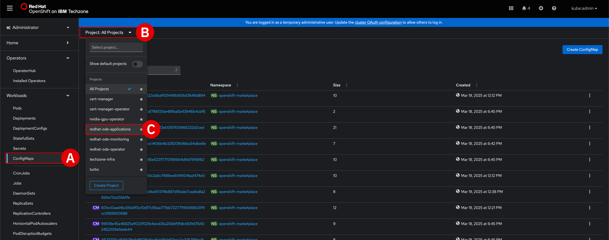
    </br>
    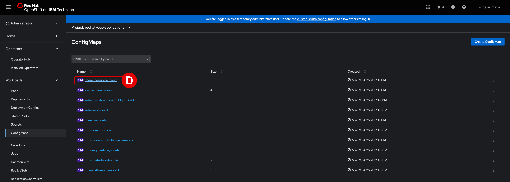
    </br>
    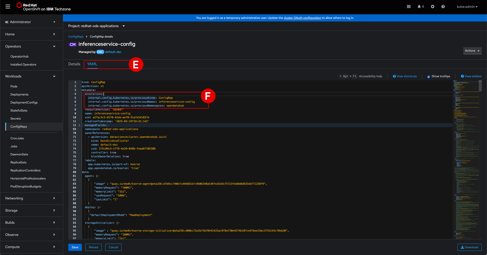
    </br>
    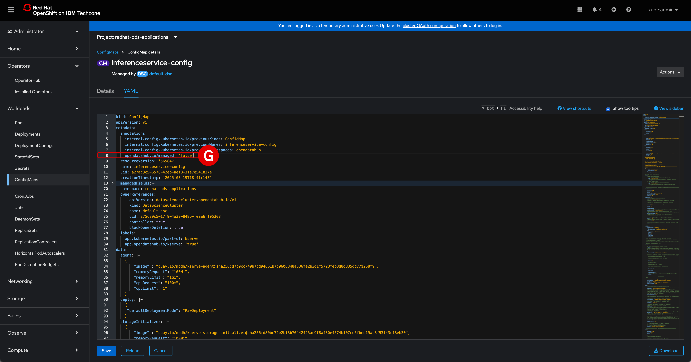

---

30. Within the same YAML file, look for Line 379 under the *ingress* section^[A]^:

    ``` yaml
    "domainTemplate": "{ .Name }-{ .Namespace }.{ .IngressDomain }",
    ```

    **Replace** Line 379 with the following (be sure to include the last `,` character)^[B]^:

    ``` yaml
    "domainTemplate": "example.com",
    ```

    Click **Save**^[C]^ (bottom-left) to finalize the changes to the YAML file. If prompted with a *Managed resource* warning, click **Save**^[D]^ again to confirm.

    !!! tip ""
        Copy and paste the full contents of the `inferenceservice-config` YAML file to a text editor.
        
        - **Search** for the the following: `datasciencecluster`
        - **Record** the full value of the `apiVersion:` attribute containing this value and save the information to a notepad for reference later.

    </br>
    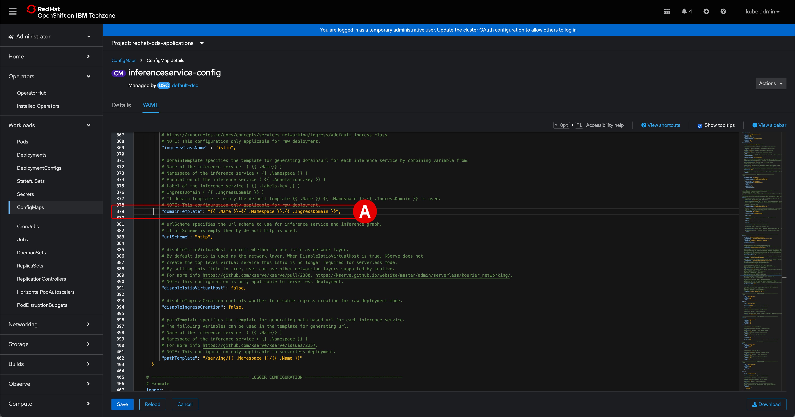
    </br>
    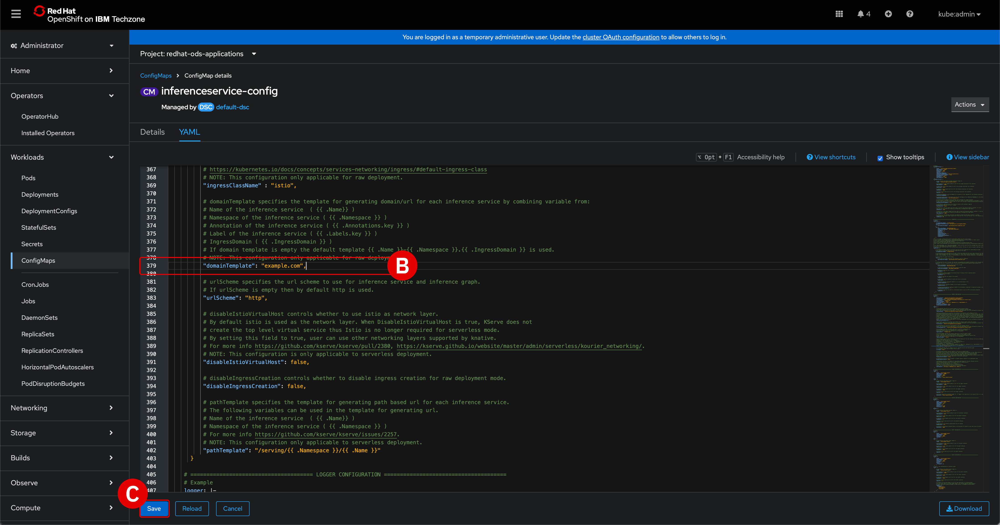
    </br>
    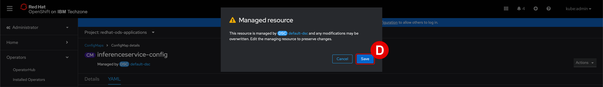

---

## **vi. Next steps**

At this stage, all of the necessary prerequisites have been installed and you are ready to begin installation of an IBM Software Hub instance on the OCP cluster.

??? note "TROUBLESHOOTING: LOGGING IN AND SESSION TIMEOUTS"
    Be aware that SSH connections made over Terminal will time out after a long period of inactivity or due to a connection error. If you need to log back into the bastion terminal, follow the procedure below. Replace the `<BASTION_PWD>` placeholder with the password specific to *your* environment.

    1. Log back into the bastion node:

        ``` shell
        ssh itzuser@api.67828ca5e432cac47ccc4230.ocp.techzone.ibm.com -p 40222 <BASTION_PWD>
        ```
    
    2. Engage the `sudo` (privileged access) session:

        ``` shell
        sudo bash
        ```

    3. Source the environment variables stored in `cpd_vars.sh`:

        ``` shell
        source cpd_vars.sh
        ```

    4. Log back into OpenShift:

        ``` shell
        ${OC_LOGIN}
        ```

    5. Log back into `cpd-cli`:

        ``` shell
        ${CPDM_OC_LOGIN}
        ```