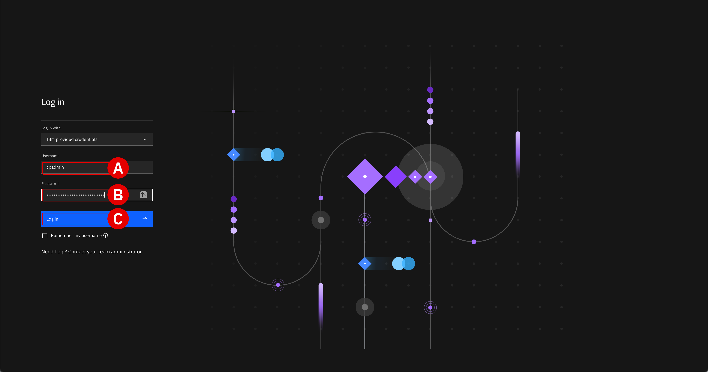
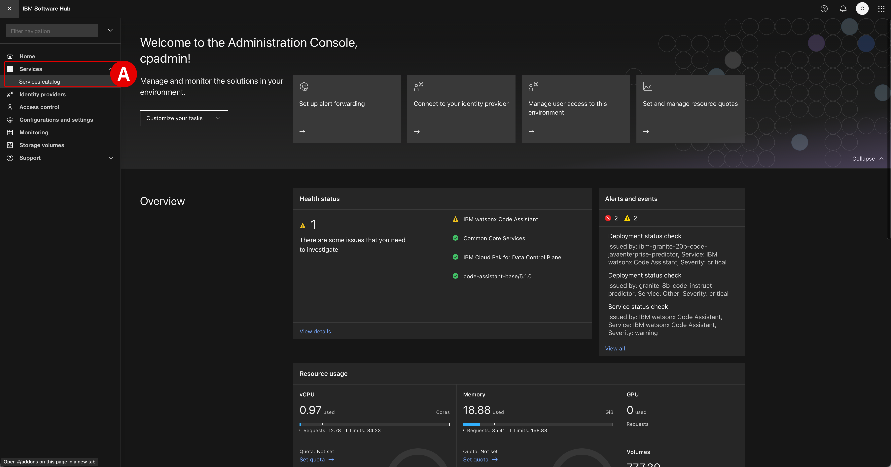
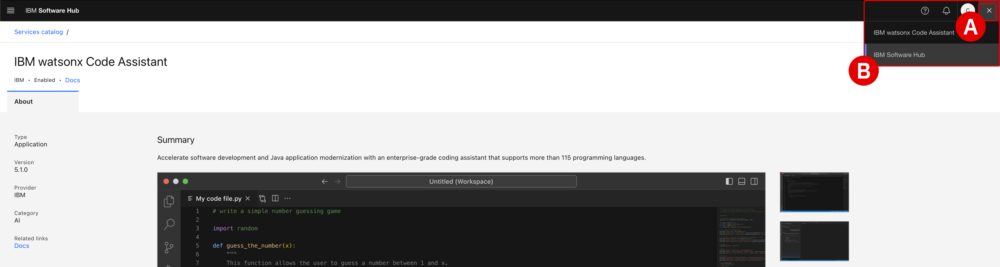
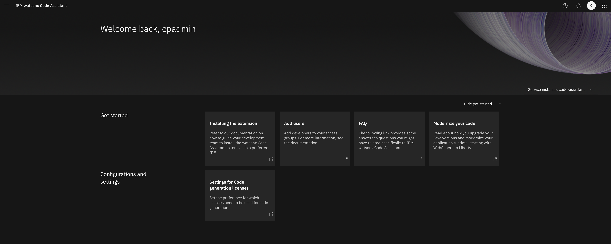

# **Install IBM watsonx Code Assistant**</br>*On-Premises Installation and Deployment*

!!! quote ""
    The following section is based off of IBM Documentation for <a href="https://www.ibm.com/docs/en/software-hub/5.1.x?topic=wca-installing" target="_blank">**Installing watsonx Code Assistant v5.1.x**</a>.

## **i. User responsibilities**

Following the release of IBM Software Hub `v5.x`, watsonx Code Assistant (WCA) administrators need to only specify the `watsonx-code-assistant` component in order for the Software Hub to automatically fetch the required dependencies.

---

To install WCA on-premises, you must be an *instance administrator* with permissions to install software in the following Red Hat OpenShift projects:

- **The *operators project* for the instance:** Operators for this instance of WCA are installed in the `operators` project. In the installation commands, the `${PROJECT_CPD_INST_OPERATORS}` environment variable refers to the operators project.

- **The *operands project* for the instance:** The custom resources for the control plane and WCA are installed in the operands project. In the installation commands, the `${PROJECT_CPD_INST_OPERANDS}` environment variable refers to the operands project.

## **ii. System requirements**

Participants are encouraged to review the following requirements again before continuing with the install to verify that all the components are in place *and* to reinforce their understanding as to why such components are needed.

---

**IBM SOFTWARE HUB VERSIONING**
</br>
All of the components that are associated with an instance of IBM Software Hub must be installed at the same release version. For example, if the IBM Software Hub control plane is installed at `Version 5.1.0`, you must install WCA at `Version 5.1.0` as well.

</br>
**ENVIRONMENT VARIABLES**
</br>
The commands in this task use environment variables so that you can run the commands exactly as written. In the case of this lab, those variables are defined within the `cpd_vars.sh` manifest that was created in **<a href="https://ibm.github.io/wca-l4/on-premises/3/" target="_blank">Module 3</a>**.

- If you want to read more about how to structure scripts like `cpd_vars.sh`, which define environment variables within a single source of truth, <a href="https://www.ibm.com/docs/en/SSNFH6_5.1.x/hub/install/collect-info-install-variables.html" target="_blank">**review the IBM Documentation**</a>.

- To use the environment variables from the script, you must source the environment variables before you run the commands in this task. For example, run:
    ``` shell
    source cpd_vars.sh
    ```

**SECURITY CONTEXT CONSTRAINT**
</br>
WCA works with the default Red Hat OpenShift® Container Platform security context constraint, `restricted-v2`.

</br>
**COMMON CORE SERVICES**
</br>
WCA requires the availability of IBM Software Hub common core services. If the common core services are not installed in the *operands* project for the instance, the common core services are automatically installed when you install WCA. The common core services installation increases the amount of time the installation takes to complete.

</br>
**STORAGE**
</br>
Storage classes must be specified ahead of time when installing WCA. The following storage classes are recommended. However, if you don't use these particular storage classes on future cluster deployments, ensure that you specify a storage class with an equivalent definition.

| Storage | Notes | Storage Classes |
| - | - | - |
| **OpenShift Data Foundation** | When you install the service, specify file storage and block storage. | **File storage:** `ocs-storagecluster-cephfs`</br>**Block storage:** `ocs-storagecluster-ceph-rbd` |
| **IBM Fusion Data Foundation** | When you install the service, specify file storage and block storage. | **File storage:** `ocs-storagecluster-cephfs`</br>**Block storage:** `ocs-storagecluster-ceph-rbd` |
| **IBM Fusion Global Data Platform** | When you install the service, specify the same storage class for both file storage and block storage. | **File storage:** `ibm-spectrum-scale-sc` or `ibm-storage-fusion-cp-sc`</br>**Block storage:** `ibm-spectrum-scale-sc` or `ibm-storage-fusion-cp-sc` |
| **IBM Storage Scale Container Native** | When you install the service, specify the same storage class for both file storage and block storage. | **File storage:** `ibm-spectrum-scale-sc`</br>**Block storage:** `ibm-spectrum-scale-sc` |
| **Portworx** | When you install the service, the `--storage_vendor=portworx` option ensures that the service uses the correct storage classes. | **File storage:** `portworx-shared-gp3`</br>**Block storage:** `portworx-elastic-sc` |
| **NFS** | When you install the service, specify the same storage class for both file storage and block storage. | **File storage:** `managed-nfs-storage`</br>**Block storage:** `managed-nfs-storage` |
| **Amazon Elastic storage** | When you install the service, specify file storage and block storage. File storage is provided by Amazon Elastic File System. Block storage is provided by Amazon Elastic Block Store. | **File storage:** `efs-nfs-client`</br>**Block storage:** `gp2-csi` or `gp3-csi` |
| **NetApp Trident** | When you install the service, specify the same storage class for both file storage and block storage. | **File storage:** `ontap-nas`</br>**Block storage:** `ontap-nas` |
| **Nutanix** | Not supported. | Not applicable. |

## **iii. Deployment checklist**

To review, the following tasks need to be completed before installing WCA on-premises. The various modules of this hands-on lab have already covered those applicable to the environment you are about to deploy. However, keep this checklist handy for future deployments you will be making with clients and in the field.

| Prerequisite | Documentation |
| - | - |
| The cluster meets the minimum requirements for installing WCA. | <a href="https://www.ibm.com/docs/en/SSNFH6_5.1.x/sys-reqs/overview-sys-reqs.html" target="_blank">**System requirements**</a> |
| The workstation from which you will run the installation is set up as a client workstation and includes the following command-line interfaces: IBM Software Hub CLI (`cpd-cli`) and OpenShift CLI (`oc`) | <a href="https://www.ibm.com/docs/en/SSNFH6_5.1.x/hub/install/setup-client.html" target="_blank">**Setting up a client workstation**</a> |
| The IBM Software Hub control plane is installed. | <a href="https://www.ibm.com/docs/en/SSNFH6_5.1.x/hub/install/install-platform.html" target="_blank">**Installing an instance of IBM Software Hub**</a> |
| For environments that use a private container registry, such as air-gapped environments, the WCA software images are mirrored to the private container registry. | <a href="https://www.ibm.com/docs/en/SSNFH6_5.1.x/hub/install/prep-cluster-mirror.html" target="_blank">**Mirroring images to a private container registry**</a> |
| For environments that use a private container registry, such as air-gapped environments, the `cpd-cli` is configured to pull the `olm-utils-v3` image from the private container registry. | <a href="https://www.ibm.com/docs/en/SSNFH6_5.1.x/hub/install/prep-cluster-move-cli-get-image.html" target="_blank">**Pulling the olm-utils-v3 image from the private container registry**</a> |
| The operators that are required to use GPUs are installed. | <a href="https://www.ibm.com/docs/en/SSNFH6_5.1.x/hub/install/prep-cluster-node-gpu.html" target="_blank">**Installing operators for services that require GPUs**</a> |
| Red Hat OpenShift AI is installed. | <a href="https://www.ibm.com/docs/en/SSNFH6_5.1.x/hub/install/prep-cluster-openshift-ai.html" target="_blank">**Installing Red Hat OpenShift AI**</a> |

## **iv. Fetching dependencies**

In the following section, participants will assume the role of an instance administrator and install WCA using the IBM Software Hub components set up in the previous module.

---

1. Apply the entitlement for WCA by **executing** the following code block:

    ``` shell
    cpd-cli manage apply-entitlement \
    --cpd_instance_ns=${PROJECT_CPD_INST_OPERANDS} \
    --entitlement=watsonx-code-assistant \
    --production=true
    ```

    !!! warning ""
        Completion of this operation will take approximately **1 minute**, after which the console will return:
        ``` shell
        [SUCCESS] 2025-03-19T23:02:06.847686Z You may find output and logs in the <REDACTED> directory.
        [SUCCESS] 2025-03-19T23:02:06.847741Z The apply-entitlement command ran successfully.
        ```

---

2. Now that the components have been defined, install the services Operators by **executing** the following code block:

    ``` shell
    cpd-cli manage apply-olm \
    --release=${VERSION} \
    --cpd_operator_ns=${PROJECT_CPD_INST_OPERATORS} \
    --components=${COMPONENTS} 
    ```
    !!! warning ""
        Completion of this operation will take approximately **15 minutes**, after which the console will return:
        ``` shell
        [SUCCESS] 2025-03-19T23:16:42.690505Z You may find output and logs in the <REDACTED> directory.
        [SUCCESS] 2025-03-19T23:16:42.690774Z The apply-olm command ran successfully.
        ```

    !!! tip ""
        **Record** the final automation task performed just prior to (the line before) the two `[SUCCESS]` messages returned by the console. Save this information to a notepad for future reference.

---

## **v. Installing software**

Creating the custom resources for watsonx Code Assistant and kicking off the installation process is achieved with relatively few inputs from the administrator, but will still require several hours to resolve.

---

3. Start the installation process for WCA by executing the following code block:

    ``` shell
    cpd-cli manage apply-cr \
    --release=${VERSION} \
    --cpd_instance_ns=${PROJECT_CPD_INST_OPERANDS} \
    --components=${COMPONENTS} \
    --block_storage_class=${STG_CLASS_BLOCK} \
    --file_storage_class=${STG_CLASS_FILE} \
    --license_acceptance=true
    ```

    !!! warning ""
        Completion of this operation may take up to **2 hours**, after which the console will return:
        ``` shell
        [SUCCESS]... The apply-cr command ran successfully
        ```

    ??? note "TROUBLESHOOTING: CONNECTION TIMED OUT"
        The time needed for the operation to complete means that participant's Terminal connections to the OCP cluster will likely time out (due to inactivity) before the installation and deployment have concluded. Do not worry - the installation will continue even if the SSH connection with Terminal is interrupted. To re-authenticate with the cluster, follow the <a href="https://ibm.github.io/wca-l4/on-premises/7/#vi-conclusion" target="_blank">**Troubleshooting: Logging in and session timeouts**</a> instructions below.

---

4. Once the installation procedure of Step 3 has wrapped up, retrieve the details about the WCA instance by **executing** the following:

    ``` shell
    cpd-cli manage get-cpd-instance-details \
    --cpd_instance_ns=${PROJECT_CPD_INST_OPERANDS} \
    --get_admin_initial_credentials=true
    ```

    - The console will return multiple lines. Take note of the lines with headers *CPD Url*, *CPD Username*, and *CPD Password*. These have been highlighted in the code sample below.
    - **Copy** the three variables from *your* Terminal's output to a notepad for reference later.

    ``` shell hl_lines="2 3 4"
    [INFO] 2025-03-20T03:20:17.481851Z Run command: podman exec -it olm-utils-play-v3 get-cpd-instance-details --cpd_instance_ns=cpd-watsonx --get_admin_initial_credentials=true
    CPD Url: cpd-cpd-watsonx.apps.67da04cc1b2e441b1d48a668.ocp.techzone.ibm.com
    CPD Username: cpadmin
    CPD Password: xEhwFROJ5rAL4DZ3ggTNKzlREXDYDYHU
    [SUCCESS] 2025-03-20T03:20:18.949702Z You may find output and logs in the <REDACTED> directory.
    [SUCCESS] 2025-03-20T03:20:18.949759Z The get-cpd-instance-details command ran successfully.
    ```

---

5. Using a web browser, navigate to the address specified by *CPU Url*. A page will load for the Administration Console which allows administrators to manage both their IBM Software Hub (CP4D) and IBM watsonx Code Assistant environments.

    - Supply the *CPD Username*^[A]^ and *CPD Password*^[B]^ values recorded in Step 4
    - Click **Login in**^[C]^ to proceed
    - The web browser will load the IBM Software Hub dashboard, from which a number of administrative and monitoring options are available for you to inspect

    </br>
    

---

6. Verify that the IBM watsonx Code Assistant service was successfully installed:

    - From the dashboard's navigation menu, drill down into **Services** > **Services catalog**^[A]^
    - Search for the *IBM watsonx Code Assistant* service tile and confirm it is marked with a status of `Enabled`
    - **Click**^[B]^ on the tile to preview the service
    - The web browser will load what essentially resembles the "catalog" view you might encounter on a online store portal such as IBM Cloud — this is *not* the administrative portal used for managing the WCA service

    </br>
    
    </br>
    

---

7. To access the WCA management console, look to the top-right corner of the IBM Software Hub dashboard and **click**^[A]^ the rectangular-dot icon. This will allow you to toggle between the Software Hub and WCA administrative portals.

    - **Click**^[B]^ the *IBM watsonx Code Assistant* button to switch portals
    - The administrative portal for WCA will load within the web browser

    </br>
    
    </br>
    

## **vi. Conclusion**

Congratulations — you have successfully completed the installation of IBM watsonx Code Assistant within an on-premises environment!</br></br>Explore and inspect various aspects of the on-premises environment as you wish, but keep in mind that without GPUs attached to the environment you will be significantly restricted in terms of usability. Some features may be unavailable or broken without such hardware. That is why for the **<a href="https://ibm.github.io/wca-l4/appmod/1/" target="_blank">Application Modernization</a>** hands-on modules, you will have full GPU access via the provided IBM Cloud environments. Those modules will delve deeply into the administrative and developer-oriented tasks that are limited for the on-premises environment.

??? warning "GPUs NOT SUPPORTED FOR L4 ON-PREMISES DEPLOYMENTS"
    Resource and budget constraints for IBM Technology Zone and the IBM Enablement teams means that GPUs are **unavailable for the on-premises portion** of the Level 4 curriculum.
    
    The NVIDIA A100 or H100 GPUs required are simply too cost-prohibitive to be made available for individual IBMers and business partners. GPUs cannot be shared in a multi-tenant access pattern for IBM watsonx Code Assistant — and, as such, at minimum two cards would need to be made available for every L4 reservation. These costs are beyond the scope of what can be supported by this training.

    Participants ***will* have access to GPUs for the IBM Cloud (SaaS) portion** of the Level 4 curriculum.

??? note "TROUBLESHOOTING: LOGGING IN AND SESSION TIMEOUTS"
    Be aware that SSH connections made over Terminal will time out after a long period of inactivity or due to a connection error. If you need to log back into the bastion terminal, follow the procedure below. Replace the `<BASTION_PWD>` placeholder with the password specific to *your* environment.

    1. Log back into the bastion node:

        ``` shell
        ssh itzuser@api.67828ca5e432cac47ccc4230.ocp.techzone.ibm.com -p 40222 <BASTION_PWD>
        ```
    
    2. Engage the `sudo` (privileged access) session:

        ``` shell
        sudo bash
        ```

    3. Source the environment variables stored in `cpd_vars.sh`:

        ``` shell
        source cpd_vars.sh
        ```

    4. Log back into OpenShift:

        ``` shell
        ${OC_LOGIN}
        ```

    5. Log back into `cpd-cli`:

        ``` shell
        ${CPDM_OC_LOGIN}
        ```