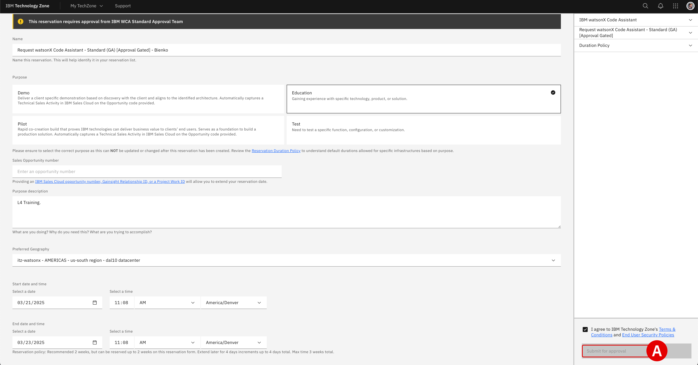

# **Reserve an environment** *IBM Cloud (SaaS) Configuration*

!!! quote ""
    The following section is partially based on IBM Cloud Documentation for <a href="https://cloud.ibm.com/docs/watsonx-code-assistant?topic=watsonx-code-assistant-cloud-setup-wca" target="_blank">**Setting up your watsonx Code Assistant service in IBM Cloud**</a>. Some of the configuration steps— such as creation of an access group and adding an access group to the deployment space -are automatically handled by IBM Technology Zone provisioning tasks. As such, if you are repeating this deployment for a client production environment, you may wish to reference the complete documentation set.

## **i. IBM Technology Zone**

The following steps will guide participants through the process for requesting access to an IBM watsonx Code Assistant (WCA) Standard Plan environment from IBM Technology Zone (ITZ).

---

1. **Open** the ITZ collection at the following address:

    !!! warning ""
        **URL:** **<a href="https://techzone.ibm.com/collection/wca/environments" target="_blank">https://techzone.ibm.com/collection/wca/environments</a>**

---

2. There are multiple templates and flavors of WCA available:

    - Locate the **Request watsonx Code Assistant - Standard**^[A]^ tile
    - Hover over and click the **IBM Cloud environment / Reserve It**^[B]^ button
    - When prompted, click the **Reserve an environment** button

     
    

---

3. Supply additional details about the ITZ reservation request:

    | Field | Value |
    | - | - |
    | **Name** | Assign the reservation a unique name. |
    | **Purpose** | `Education` |
    | **Purpose Description** | Assign the reservation a unique description. |
    | **Preferred Geography** | Select the region and data center closest to your location. |
    | **Start Date and Time** | Select a time and date for when the reservation will begin. |
    | **End Date and Time** | Select a time and date for when the reservation will expire. |

    When ready, verify that you agree to the *Terms and Conditions* for the environment and finalize your reservation request by clicking **Submit**^[A]^.
    
     
    

---

4. Navigate to the **<a href="https://techzone.ibm.com/my/reservations" target="_blank">My Reservations</a>** tab of the ITZ to monitor the progress. Initially, the request will be marked as *Scheduled* or *Provisioning*^[A]^.
    
    - **Wait** for the ITZ reservation to be marked as *Ready* before continuing to Step 5

     
    

    !!! note ""
        - **Scheduled:** marked in grey, the reservation is awaiting approval from ITZ
        - **Provisioning:** marked in yellow, the reservation is being deployed
        - **Ready:** marked in green, the reservation has successfully deployed

## **ii. Accessing the service details**

Once the WCA service has been provisioned, you will receive **two** emails with the following headers:

- **Reservation Ready on IBM Technology Zone:** indicates that the ITZ cluster has been successfully provisioned
- **Account: Action required: You are invited to join an account in IBM Cloud:** additional steps required by the administrator (you) in order to link the WCA service to IBM Cloud

---

5. Steps must be taken to link the WCA service and IBM Cloud accounts at this time.

    - Click the **Join now**^[A]^ button within the body of the *Account: Action required: You are invited to join an account in IBM Cloud* email
    - A web browser tab will launch and redirect to IBM Cloud

     
    {: loading=lazy width="400"}
     
    {: loading=lazy width="400"}

---

6. Check the **I accept the product Terms and Conditions of this registration form**^[A]^ box under the *Account Notice* header, then click **Join account**^[B]^ to continue.

     
    
    
---

7. You will be presented with a prompt asking for your permission to switch your personal IBM Cloud account's view into the WCA service (ITZ-provisioned) IBM Cloud account — which will resemble something like `itz-watsonx-24`. Click **Proceed**^[A]^ to confirm.

    !!! note "LOCATING THE ITZ-PROVISIONED ACCOUNT NAME"
        Participants can retrieve the name of the ITZ-provisioned WCA service account (`itz-watsonx-24`, etc.) by looking at the contents of the **Account: Action required: You are invited to join an account in IBM Cloud** email: *IBM Technology Zone invited you to join the following IBM Cloud account: itz-watsonx-...*

     
    

---

8. The IBM Cloud dashboard will now load within your web browser. At this time, confirm you are logged in under the WCA service account by inspecting the drop-down menu^[A]^ as shown in the screenshot below.

    !!! note "SWITCHING BETWEEN IBM CLOUD ACCOUNTS"
        You can toggle between various IBM Cloud accounts at-will. However, for the purposes of this lab it's best that you remain under the WCA service^[B]^ account.
        
     
    
    
---

9. Open a new web browser tab and navigate to the **<a href="https://techzone.ibm.com/my/reservations" target="_blank">My Reservations</a>** ITZ page to inspect the details of your newly-provisioned service (or follow the link provided in the *Reservation Ready on IBM Technology Zone*) email. Click on the newly-provisioned service's tile^[A]^ to inspect the environment's access and authentication details.

     
    

---

10. Scroll down the page to the *Reservations Details* section and locate the following values. You will need to record these to a notepad for future reference.

    - *IBM Cloud Service ID*^[A]^
    - *IBM Cloud API key*^[B]^
    - *WCA URL*^[C]^

     
    

---

11. Open a new browser tab and navigate to the **WCA URL** recorded in Step 10.

    - A *Resource list* view on IBM Cloud will load
    - Click the **Launch watsonx Code Assistant**^[A]^ button to continue

     
    

---

## **iii. Configuring the environment**

A new tab will load to present the **WCA Dashboard**, which for a first-time login will automatically prompt you to configure the environment.

---

12. When presented with the *Set up watsonx Code Assistant for Standard plan* panel, click on the **Set up**^[A]^ button to continue.

     
    

---

13. *Type of installation* configuration options must be configured. Select **Single user**^[A]^.

     
    

---

14. Having specified the installation type, more options will unlock further down the page under the *Steps to complete* header.

    Click the **blue arrow**^[A]^ icon to the right of the *Create a deployment space* option.

     
    

---

15. Configure the **Create a deployment space** page as follows:

    - *Name^[A]^:* Assign a name of your choosing to the deployment space (e.g. `wca-l4`)
    - *Description^[B]^:* Optional
    - *Select storage service^[C]^:* Do not change. IBM Technology Zone has automatically assigned Cloud Object Storage space for this reservation.
    - *Code assistant service^[D]^:* Click the drop-down menu and select the WCA service belonging to your account.

    All other fields can remain as their default values. When ready, click **Create**^[E]^ and remain on the page for the deployment to finish.

     
    

---

16. Once the deployment space has been prepared, a pop-up alert will display *"The space is ready"*. Click the **X**^[A]^ icon in the top-right corner to dismiss the message and continue with the configuration steps.

     
    

---

17. The web browser will return to the set up wizard, which now displays additional options under the *Steps to complete* section.

    - Notice that the *Create a deployment space* step has been marked as complete.

    - Click the **blue arrow**^[A]^ icon to the right of the *Select your license preference for response generations* option to continue.

     
    

---

18. The *Display of Code Suggestions* page permits users to configure how to display code suggestions returned by the WCA service.

    - **Do not change** any of the settings, but you are welcome to review them if you wish
    - **Close** the page and return to the set up wizard

     
    

---

19. **Check**^[A]^ the box to the left of the *Select your license preference for response generations* option to mark the task as complete.

    - A prompt will appear to indicate that all setup tasks are now complete
    - Click the **Go to home page**^[B]^ button to conclude the setup

     
    
     
    

---

## **iv. Create a service ID and API key**

Participants will use this API key later to enable Visual Studio Code extensions or Eclipse IDE plug-ins to communicate with the WCA service.

---

20. Open a new web browser tab and navigate to the <a href="https://cloud.ibm.com/iam/serviceids" target="_blank">**IBM Cloud Service IDs**</a> admin page.

    - Verify that the **Service IDs**^[A]^ tab is open and that the **Resource Group**^[B]^ is set to the ITZ-provisioned WCA account (Steps 7-8)
    - Click **Create service ID**^[C]^ to continue

     
    

---

21. Set the **Name**^[A]^ field equal to `IBM watsonx Code Assistant user` or another name of your choosing. Click the **Create**^[B]^ button to continue.

     
    

---

22. From the tabs along the left side of the page, click **API Keys**^[A]^. Once it loads, click **Create**^[B]^ to continue.

     
    

---

23. Create a new **IBM Cloud API Key** with the following parameters:

    - *Name^[A]^:* `IBM watsonx Code Assistant API key`
    - *Leaked action^[B]^:* `Disable the leaked key`
    - *Session creation^[C]^:* `No`
    - When ready, click **Create**^[D]^ to finalize the key

     
    

---

24. A prompt will appear reporting that *API key successfully created*.

    - Click the **Copy**^[A]^ button and record the *WCA API Key* to your notebook for reference later
    - It's recommended that you also **Download** the key as a redundancy
    - When ready, **close**^[B]^ the window

     
    

---

## **v. Add the service ID to the WCA deployment space**

With the *Service ID* and *WCA API Key* now generated, they need to be associated with your WCA instance — specifically, the WCA *Deployment Space*. This will be the way in which the WCA extension (VS Code or Eclipse IDE) communicates with the WCA service.

---

25. Return to the **WCA Dashboard** web browser tab (where you left off in Step 19).

    - Click the **stacked tiles**^[A]^ in the top-left corner of the dashboard to expand the menu items along the left-hand side
    - Click on the **Deployments**^[B]^ tab

     
    

---

26. Within the table of existing deployments, click the **wca-l4**^[A]^ deployment (or whatever name you chose to assign the deployment created in Step 15).

     
    

---

27. From the tabs along the top, click the **Manage**^[A]^ tab. Then, from the left-hand side options, click the **Access control**^[B]^ tab.

     
    
     
    

---

28. Click the **Add collaborators**^[A]^ button to expand a list of options, then click **Add service IDs**^[B]^ to continue.

     
    

---

29. Within the table of *Service IDs*, you should see 1 entry for the `IBM watsonx Code Assistant user` that was created in Step 21.

    - **Click**^[A]^ the box to the left of the ID
    - **Click**^[B]^ the *Role* box to the right of the ID and select **Editor** from the drop-down menu
    - Click **Add**^[C]^ to finalize the operation

     
    

---

30. Confirm that the `IBM watsonx Code Assistant user` *Service ID* now appears within the list of approved *Collaborators* under the **Access Control** tab.

---

## **vi. Next steps**

The deployment and initial configurations of the watsonx Code Assistant (SaaS) Standard Plan service on IBM Cloud is now complete. In the following modules, participants will prepare the WCA extensions and plug-ins for Visual Studio Code and Eclipse IDE, respectively.