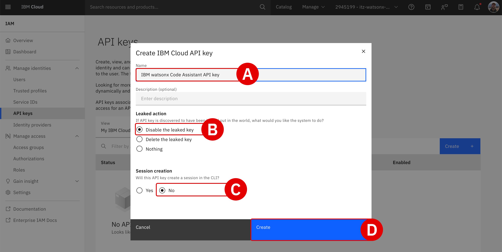

!!! quote ""
    The following section is partially based on IBM Cloud Documentation for <a href="https://cloud.ibm.com/docs/watsonx-code-assistant?topic=watsonx-code-assistant-cloud-setup-wca" target="_blank">**Setting up your watsonx Code Assistant service in IBM Cloud**</a>. Some of the configuration steps— such as creation of an access group and adding an access group to the deployment space -are automatically handled by IBM Technology Zone provisioning tasks. As such, if you are repeating this deployment for a client production environment, you may wish to reference the complete documentation set.

## **iii. Configuring the environment**

A new tab will load to present the **WCA Dashboard**, which for a first-time login will automatically prompt you to configure the environment.

---

12. When presented with the *Set up watsonx Code Assistant for Standard plan* panel, click on the **Set up**^[A]^ button to continue.

    </br>
    

---

13. *Type of installation* configuration options must be configured. Select **Single user**^[A]^.

    </br>
    

---

14. Having specified the installation type, more options will unlock further down the page under the *Steps to complete* header.

    Click the **blue arrow**^[A]^ icon to the right of the *Create a deployment space* option.

    </br>
    

---

15. Configure the **Create a deployment space** page as follows:

    - *Name^[A]^:* Assign a name of your choosing to the deployment space (e.g. `wca-l4`)
    - *Description^[B]^:* Optional
    - *Select storage service^[C]^:* Do not change. IBM Technology Zone has automatically assigned Cloud Object Storage space for this reservation.
    - *Code assistant service^[D]^:* Click the drop-down menu and select the WCA service belonging to your account.

    All other fields can remain as their default values. When ready, click **Create**^[E]^ and remain on the page for the deployment to finish.

    </br>
    

---

16. Once the deployment space has been prepared, a pop-up alert will display *"The space is ready"*. Click the **X**^[A]^ icon in the top-right corner to dismiss the message and continue with the configuration steps.

    </br>
    

---

17. The web browser will return to the set up wizard, which now displays additional options under the *Steps to complete* section.

    - Notice that the *Create a deployment space* step has been marked as complete.

    - Click the **blue arrow**^[A]^ icon to the right of the *Select your license preference for response generations* option to continue.

    </br>
    

---

18. The *Display of Code Suggestions* page permits users to configure how to display code suggestions returned by the WCA service.

    - **Do not change** any of the settings, but you are welcome to review them if you wish
    - **Close** the page and return to the set up wizard

    </br>
    

---

19. **Check**^[A]^ the box to the left of the *Select your license preference for response generations* option to mark the task as complete.

    - A prompt will appear to indicate that all setup tasks are now complete
    - Click the **Go to home page**^[B]^ button to conclude the setup

    </br>
    
    </br>
    

---

## **iv. Create a service ID and API key**

Participants will use this API key later to enable Visual Studio Code extensions or Eclipse IDE plug-ins to communicate with the WCA service.

---

20. Open a new web browser tab and navigate to the <a href="https://cloud.ibm.com/iam/serviceids" target="_blank">**IBM Cloud Service IDs**</a> admin page.

    - Verify that the **Service IDs**^[A]^ tab is open and that the **Resource Group**^[B]^ is set to the ITZ-provisioned WCA account (Steps 7-8)
    - Click **Create service ID**^[C]^ to continue

    </br>
    

---

21. Set the **Name**^[A]^ field equal to `IBM watsonx Code Assistant user` or another name of your choosing. Click the **Create**^[B]^ button to continue.

    </br>
    

---

22. From the tabs along the left side of the page, click **API Keys**^[A]^. Once it loads, click **Create**^[B]^ to continue.

    </br>
    

---

23. Create a new **IBM Cloud API Key** with the following parameters:

    - *Name^[A]^:* `IBM watsonx Code Assistant API key`
    - *Leaked action^[B]^:* `Disable the leaked key`
    - *Session creation^[C]^:* `No`
    - When ready, click **Create**^[D]^ to finalize the key

    </br>
    

---

24. A prompt will appear reporting that *API key successfully created*.

    - Click the **Copy**^[A]^ button and record the *WCA API Key* to your notebook for reference later
    - It's recommended that you also **Download** the key as a redundancy
    - When ready, **close**^[B]^ the window

    </br>
    

---

## **v. Add the service ID to the WCA deployment space**

With the *Service ID* and *WCA API Key* now generated, they need to be associated with your WCA instance — specifically, the WCA *Deployment Space*. This will be the way in which the WCA extension (VS Code or Eclipse IDE) communicates with the WCA service.

---

25. Return to the **WCA Dashboard** web browser tab (where you left off in Step 19).

    - Click the **stacked tiles**^[A]^ in the top-left corner of the dashboard to expand the menu items along the left-hand side
    - Click on the **Deployments**^[B]^ tab

    </br>
    

---

26. Within the table of existing deployments, click the **wca-l4**^[A]^ deployment (or whatever name you chose to assign the deployment created in Step 15).

    </br>
    

---

27. From the tabs along the top, click the **Manage**^[A]^ tab. Then, from the left-hand side options, click the **Access control**^[B]^ tab.

    </br>
    
    </br>
    

---

28. Click the **Add collaborators**^[A]^ button to expand a list of options, then click **Add service IDs**^[B]^ to continue.

    </br>
    

---

29. Within the table of *Service IDs*, you should see 1 entry for the `IBM watsonx Code Assistant user` that was created in Step 21.

    - **Click**^[A]^ the box to the left of the ID
    - **Click**^[B]^ the *Role* box to the right of the ID and select **Editor** from the drop-down menu
    - Click **Add**^[C]^ to finalize the operation

    </br>
    

---

30. Confirm that the `IBM watsonx Code Assistant user` *Service ID* now appears within the list of approved *Collaborators* under the **Access Control** tab.

---

## **vi. Next steps**

The deployment and initial configurations of the watsonx Code Assistant (SaaS) Standard Plan service on IBM Cloud is now complete. In the following modules, participants will prepare the WCA extensions and plug-ins for Visual Studio Code and Eclipse IDE, respectively.


# **Configure the enterprise Java environment**</br>*IBM Cloud (SaaS) Configuration*

## **i. Objectives and rationale**

As participants will be working with the IBM watsonx Code Assistant (WCA) Standard Plan and interacting with enterprise Java applications, they will need to perform some additional configuration of their Windows or MacOS machines before setting up the extensions (or plug-ins) to the WCA service.

Locally you must **install** *both* Java and Apache Maven. Details and download links for the two are summarized in the table below.

**Java Requirements**

| Distribution | Details | Resources |
| - | - | - |
| **Java** | Java SE 11 with Java Developer Kit 21. | **<a href="https://www.oracle.com/java/technologies/downloads/?er=221886#jdk21-mac" target="_blank">Download</a>** |
| **Maven** | Use Maven to build your application. If you are using Liberty Tools and the Liberty Maven plug-in to build your app or project, use at least Maven 3.8.6. | **<a href="https://maven.apache.org/download.cgi" target="_blank">Download</a>** |

## **ii. Java installation**

---

1. **Download** and **install** the `v21` of the *Java Developer Kit* (JDK) using the vendor link below.

    !!! note ""
        
        **URL:** **<a href="https://www.oracle.com/java/technologies/downloads/?er=221886#jdk21-mac" target="_blank">https://www.oracle.com/java/technologies/downloads/?er=221886#jdk21-mac</a>**

    - Participants must install **JDK 21**
    - From the downloads page, ensure that the **JDK 21**^[A]^ option is selected
    - Further down the page, click the operating system^[B]^ option that aligns with your machine operating system type (e.g. *macOS*)
    - Click the link for the **Download**^[C]^ link for the installer that matches your machine's processing architecture (e.g. newer-generation *macOS* users will probably want to select the *ARM64 DMG Installer*)
    - Follow the prompts of the installation wizard and complete the installation before continuing to Step 2

    </br>
    

    !!! warning "INCOMPATIBILITY WITH JDK 24"
        Note that the *Full stack modernization* module in <a href="https://ibm.github.io/wca-l4/appmod/8/#i-objectives" target="_blank">**Application Modernization - WebSphere to Liberty**</a> will encounter compatibility errors with JDK 24 drivers when attempting to Explain or Modernize the source application. This is owing to a deprecation of `sun.misc.Unsafe` method as of March 2025. <a href="https://openjdk.org/jeps/498" target="_blank">**Additional details may be found here.**</a>

        As a result, participants in this lab should ensure they are running **JDK 21** (or as early as JDK 11), but specifically *not* JDK 24. If you are running JDK 24, you should uninstall the JDK from your machine and reinstall with the links provided in <a href="https://ibm.github.io/wca-l4/saas/3/" target="_blank">**Configure the enterprise Java environment**</a>.

---

2. With your preferred Java distribution installed locally, you now need to set the appropriate environment variables.

    Find the Java installation path on your local machine using the instruction set that corresponds to your local operating system.

    - **macOS:**
        - Open a Terminal and execute:
        ``` shell
        /usr/libexec/java_home
        ```
        - The output should resemble something like: `/Library/Java/JavaVirtualMachines/jdk-21.jdk/Contents/Home`
        - Record this path to a notepad for reference in *Step 3*
    - **Windows:**
        - Open a Command Prompt and execute:
        ``` shell
        echo %JAVA_HOME%
        ```
        - If the `JAVA_HOME` variable has not yet been set, the Java installations are typically located in the `C:\Program Files\Java\jdk-XX.X.X` directory
        - Record this path to a notepad for reference in *Step 3*

---

3. Set the `JAVA_HOME` environment variable.

    !!! note ""
        Modify the **JAVA_HOME** path in the `export JAVA_HOME=/.../` statements below if the pathway recorded in *Step 2* for *your machine* differs. For example, if using a different Java developer kit version from JDK 24, replace `/jdk-24.jdk/` with the version installed on *your* machine.
    </br>

    - **macOS:**
        - Edit the shell configuration file (`zsh`) with Terminal:
        ``` shell
        nano ~/.zshrc
        ```
        - Add the following line to the file:
        ``` shell
        export JAVA_HOME=/Library/Java/JavaVirtualMachines/jdk-21.jdk/Contents/Home
        export PATH=$JAVA_HOME/bin:$PATH
        ```
        - Save by pressing ++ctrl++ + ++o++ and hit ++return++ to confirm the filename
        - Exit by pressing ++ctrl++ + ++x++
    - **Windows:**
        - Open the *Start* menu and search for `Environment Variables`
        - Select *Edit the system environment variables* option
        - Click the *Environment Variables* button
        - Under *System Variables*, click *New*
        - Set the *Variable Name* = `JAVA_HOME` and *Variable Value* = *JDK path from Step 1* (e.g. `C:\Program Files\Java\jdk-21`)
        - Click *OK* to finalize

---

4. Apply the changes immediately.
    - **macOS**:
        - Run the following command with Terminal:
        ``` shell
        source ~/.zshrc
        ```
        - If no errors are reported, the variables have been successfully sourced (set)
    - **Windows:**
        - Close all open command prompts or terminals
        - Open a *new* Command Prompt to pick up the changes

---

5. Verify the `JAVA_HOME` environment variable has been correctly set.
    - **macOS:**
        - With Terminal, execute:
        ``` shell
        echo $JAVA_HOME
        ```
        - The console will return the Java installation path
    - **Windows:**
        - With Command Prompt, execute:
        ``` shell
        cmd echo %JAVA_HOME%
        ```
        - The console will return the Java installation path

## **iii. Maven installation**

---

6. **Download** and **install** the latest Maven distribution using either the MacOS or Windows instruction sets below.
    - **macOS:**
        - The simplest method is using <a href="https://brew.sh" target="_blank">**Homebrew**</a> to install and deploy Maven locally. To install Homebrew, execute the following with Terminal:
        ```
        /bin/bash -c "$(curl -fsSL https://raw.githubusercontent.com/Homebrew/install/HEAD/install.sh)"
        ```
        - With Terminal, execute:
        ```
        brew install maven
        ```
        - Follow the prompts (confirming with `yes` if asked to confirm the install)
        - After the install process has concluded, test with Terminal:
        ```
        mvn --version
        ```
    - **Windows:**
        - Visit the official Maven website: <a href="https://maven.apache.org/download.cgi" target="_blank">https://maven.apache.org/download.cgi</a>
        - Under **Files**, click on the binary zip archive link (for example, `apache-maven-x.x.x-bin.zip`)
        - Extract the zip file to a location on your local machine (for example, `C:\Apache\maven\`)
        - **Replace** `<path-to-folder>` with your machine's installation path and then execute the following with Command Prompt:
        ```
        MAVEN_HOME= <path-to-folder>\maven\apache-maven-3.9.9-bin\apache-maven-3.9.9
        ```
        - **Replace** `<path-to-folder>` with your machine's installation path and then execute the following with Command Prompt:
        ```
        <path-to-folder>\maven\apache-maven-3.9.9-bin\apache-maven-3.9.9\bin
        ```
        - Maven is now successfully installed and configured

---

## **iv. Determine the JDK**

For Visual Studio (VS) Code and WCA Standard Plans, watsonx Code Assistant needs to determine which Java developer kit (JDK) to use, in the following order of precedence (with *1* being the highest priority):

| Order of precedence | Description |
| - | - |
| **1** | Globally-configured Java developer kit for automatic building in the Red Hat extension, which is `java.configuration.runtimes` in the IDE `settings.json` file |
| **2** | `java.jdt.ls.java.home` or `java.home` IDE settings if they are present |
| **3** | `JAVA_HOME` system environment variable, or else `JDK_HOME` |
| **4** | The Java developer kit in the system `PATH` |

When WCA Standard Plan features are used, such as Java modernization or upgrade, you can verify which Java developer kit is being used:
    
- Within the VS Code IDE, click **View** and then **Output**
- In the *Output* view, use the dropdown menu to select **WCA**
- Look for a message such as `Using the Java developer kit that is defined in <location> to run watsonx Code Assistant components. The path is: <path>` to determine the feature currently in use

---

## **v. Set the logging level**

To adjust logging for the VS Code extension for WCA:

- From the **Extensions** panel of VS Code, locate the WCA extension and right-click to pull down a list of available options
- Select the **Extension Settings** option
- Scroll down (or search) for **WCA: Log level**
- You may adjust this field from the default `INFO` setting to alternative options (like `WARN`) to cycle between various logging levels

---

## **vi. Next steps**

In the following modules, participants will prepare the WCA extensions and plug-ins for Visual Studio Code and Eclipse IDE, respectively.