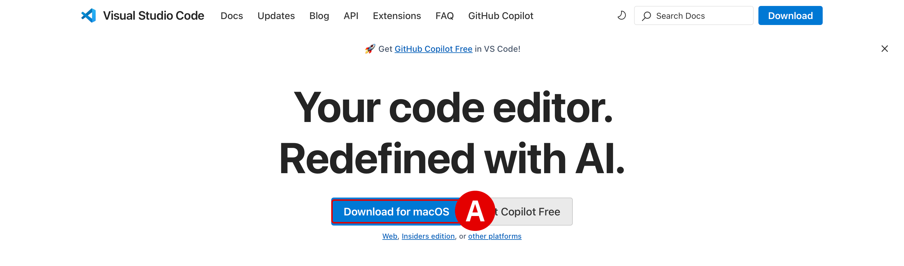
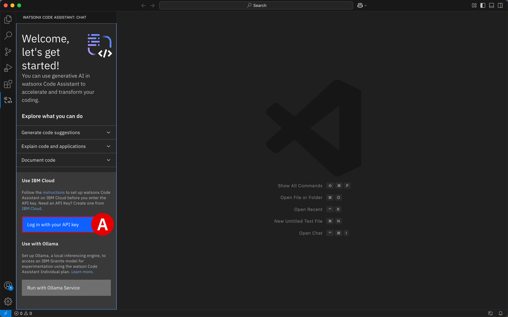

# **Install WCA extension for Visual Studio Code**</br>*IBM Cloud (SaaS) Configuration*

## **i. Objectives and rationale**

With the IBM watsonx Code Assistant (WCA) service component of the Software-as-a-Service (SaaS) architecture now successfully provisioned via the IBM Technology Zone (ITZ), participants will now need to set up the WCA extension within an integrated development environment (IDE). WCA currently supports both *Visual Studio Code* (**VS Code**) and *Eclipse IDE*.

This module guides participants through the process of installing VS Code on their local machine. Afterwards, the WCA extension ("plug-in") can then be easily integrated with the IDE and authorized for use with the ITZ-provisioned WCA service.

!!! note "WHY INSTALL LOCALLY?"
    Be aware that ITZ only allows two environments to be reserved for education and training purposes at any one time. Reservations for client demonstrations and pilots do not count against this limit.
    
    The WCA Standard plan on SaaS (this module) requires at least one reservation slot. The on-premises environment already provisioned through ITZ for the previous <a href="https://ibm.github.io/wca-l4/on-premises/1/" target="_blank">**On-Premises Installation and Deployment**</a> modules is occupying the second available slot. Provisioning an ITZ-hosted virtual machine (VM) environment will require a third slot — exceeding what ITZ supports. Therefore, to accommodate a virtualized desktop, participants would **need to retire and deprovision** the on-premises environment that they've already gone to great lengths to set up. Let's avoid that scenario, if possible.

    IBM watsonx Code Assistant works great on locally-installed IDEs via extensions (or plug-ins) built into VS Code and Eclipse IDE, respectively. In fact, it's the *de facto* way to interact with the service and provides the best impression for users — with a less cumbersome experience executing the lab guide instructions and much more responsive IDE interactions.

## **ii. Locally install VS Code**

Before you configure the extension for VS Code, you must first install the application on your machine.

---

1. Download the latest **Stable Build**^[A]^ release of VS Code available for your machine's operating system using the link below.

    </br>
    

    !!! warning ""
        **Download**: <a href="https://code.visualstudio.com" target="_blank">https://code.visualstudio.com</a>

        Follow along with the installer wizard steps and continue with the hands-on lab instructions once VS Code is running on your local machine.

---

2. Launch the VS Code application and take note of the sidebar along the left-side.

    Click the **Extensions**^[A]^ icon to open the marketplace of services and open source technologies that can be integrated with VS Code.

    </br>
    

---

## **iii. Install the extension**

Search for the <a href="https://marketplace.visualstudio.com/items?itemName=IBM.wca-eja" target="_blank">**watsonx Code Assistant for Enterprise Java Applications**</a> extension, which corresponds to the WCA Standard plan. This plug-in supports all the features of the Essentials plan, plus enterprise Java modernization capabilities, enhanced code explanation, and enhanced unit test generation — all of which will be necessary for the Level 4 curriculum and hands-on training.

---

3. Into the **search bar**^[A]^ under the *Extensions* tab, enter the following text:

    ``` shell
    watsonx Code Assistant for Enterprise Java Applications
    ```

    - After locating the extension, click the **Install**^[B]^ button
    - When prompted, select **Trust Publisher & Install**^[C]^ to confirm the procedure

    </br>
    
    </br>
    

    !!! note "OTHER EXTENSIONS ARE AVAILABLE"
        Note that Standard plan installation creates **two** entries in your Visual Studio Code Extensions panel: one for *watsonx Code Assistant* and one for *watsonx Code Assistant for Enterprise Java Applications*. The two extensions are dependencies for this installation.
        
        Two other plug-ins are available within VS Code for *IBM watsonx Code Assistant* specifically, and even more for other offerings such as *IBM watsonx Code Assistant for Red Hat Ansible Lightspeed* and *IBM watsonx Code Assistant for Z*. For WCA, there are alternative extensions available for <a href="https://marketplace.visualstudio.com/items?itemName=IBM.wca-core" target="_blank">**Trial Plan**</a> and <a href="https://marketplace.visualstudio.com/items?itemName=IBM.wca-core" target="_blank">**Essential Plan**</a> tiers.

---

4. To open WCA within VS Code, click on the **watsonx Code Assistant**^[A]^ icon that has appeared along the left-hand side of VS Code. You will be greeted with a `Welcome, let's get started!` prompt within the IDE.

    </br>
    

---

5. Now let's authorize the extension for use with the WCA service provisioned on IBM Cloud. From the WCA panel, click **Log in with your API key**^[A]^ to continue.

    </br>
    

---

6. A drop-down menu will open at the top of the VS Code interface. **Copy and paste**^[A]^ the *WCA API Key* that was recorded in <a href="https://ibm.github.io/wca-l4/saas/2/#iv-create-a-service-id-and-api-key" target="_blank">**Step 24 of Module 2**</a> into the prompt.

    - The interface should display a line of text indicating a *Valid API Key* has been detected
    - Press ++return++ to confirm the input
    - When prompted with *The extension 'watsonx Code Assistant' wants to sign in using WCA API Key*, click **Allow**^[B]^

    </br>
    
    </br>
    

---

7. Confirm that the extension successfully authenticated with the WCA service by looking for an open *Chat session 1* with `watsonx` along the left side of the WCA Extension tab^[A]^. If this Chat interface is available and operational, that confirms that VS Code extension has been successfully integrated with the WCA service.

    </br>
    

---

## **iv. Next steps**

At this stage, the WCA Standard Plan extension for VS Code has been successfully installed and configured. The following module will guide participants through the steps of locally configuring Eclipse IDE for use with the WCA extension.