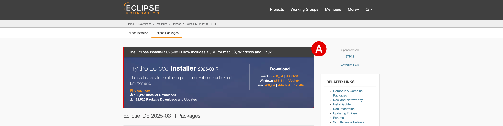
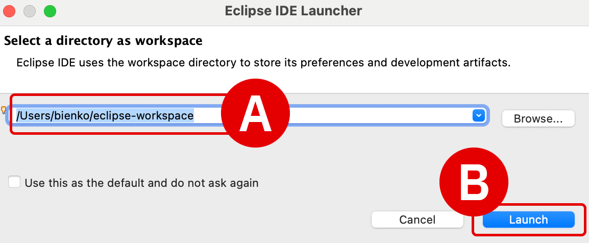
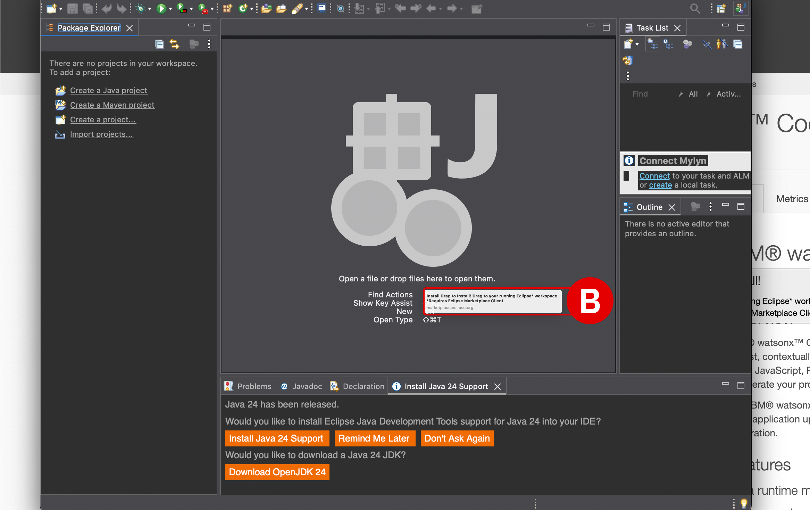
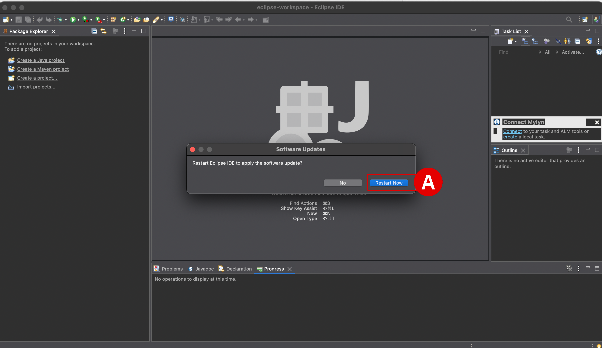
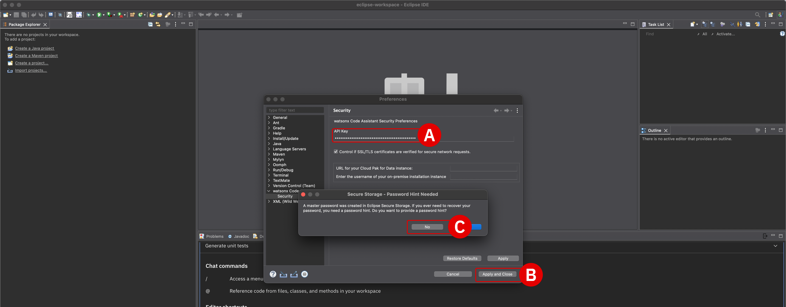

# **Install WCA plug-in for Eclipse IDE** *IBM Cloud (SaaS) Configuration*

## **i. Objectives and rationale**

With the IBM watsonx Code Assistant (WCA) service component of the Software-as-a-Service (SaaS) architecture now successfully provisioned via the IBM Technology Zone (ITZ), participants will now need to set up the WCA extension within an integrated development environment (IDE). WCA currently supports both *Visual Studio Code* (**VS Code**) and *Eclipse IDE*.

This module guides participants through the process of installing **Eclipse IDE** on their local machine. Afterwards, the WCA extension ("plug-in") can then be easily integrated with the IDE and authorized for use with the ITZ-provisioned WCA service.

!!! note "WHY INSTALL LOCALLY?"
    Be aware that ITZ only allows two environments to be reserved for education and training purposes at any one time. Reservations for client demonstrations and pilots do not count against this limit.
    
    The WCA Standard plan on SaaS requires at least one reservation slot. The on-premises environment already provisioned through ITZ for the previous <a href="https://ibm.github.io/wca-l4/on-premises/1/" target="_blank">**On-Premises Installation and Deployment**</a> modules is occupying the second available slot. Provisioning an ITZ-hosted virtual machine (VM) environment will require a third slot — exceeding what ITZ supports. Therefore, to accommodate a virtualized desktop, participants would **need to retire and deprovision** the on-premises environment that they've already gone to great lengths to set up. Let's avoid that scenario, if possible.

    IBM watsonx Code Assistant works great on locally-installed IDEs via extensions built into VS Code and Eclipse IDE. In fact, it's the *de facto* way to interact with the service and provides the best impression for users by far — with a less cumbersome experience with the lab guide instructions and much more responsive IDE interactions.

## **ii. Locally install Eclipse IDE**

With the IBM Cloud credentials set up, the next step will be to install the Eclipse IDE locally and then integrate it with the WCA service via the IDE plug-in.

---

1. **Download** the *Eclipse IDE* from the Eclipse Foundation.

    - Use the **Eclipse Installer**, recommended at the top of the download page^[A]^
    - Select the version appropriate to your local machine's operating system

    !!! warning ""
        **URL:** <a href="https://www.eclipse.org/downloads/packages/" target="_blank">https://www.eclipse.org/downloads/packages/</a>

     
    

---

2. Run the installer on your local machine.

    - Select the **Eclipse IDE for Java Developers** option^[A]^
    - Follow along with the remaining prompts until the Eclipse IDE has been installed
    - Once the install process has concluded, click **Launch**^[B]^ from the installer or manually launch the Eclipse IDE application yourself

     
    {: loading=lazy width="300"}
     
    {: loading=lazy width="300"}

---

3. Upon launching the Eclipse IDE for the first time, users will be prompted to *Select a directory as workspace*. Choose a directory on your local machine^[A]^ you feel appropriate (or select the one selected by default for you) and then click **Launch**^[B]^ to continue.

     
    {: loading=lazy width="300"}

---

## **iii. Install the plug-in**

Open the <a href="https://marketplace.eclipse.org/content/ibm®-watsonx™-code-assistant-enterprise-java-applications" target="_blank">**Eclipse Marketplace**</a> listing for *IBM watsonx Code Assistant for Enterprise Java Applications* plug-in, which corresponds to the WCA Standard plan. This plug-in supports all the features of the Essentials plan, plus enterprise Java modernization capabilities, enhanced code explanation, and enhanced unit test generation — all of which will be necessary for the Level 4 curriculum.

---

4. Locate the **Install** button on the Eclipse Marketplace page. The easiest method for installing this plug-in is to **click and hold**^[A]^ the mouse button down on this Install button, then **drag and release**^[B]^ on top of the open Eclipse IDE application.

    - An install wizard will open within the Eclipse IDE automatically
    - *Confirm Selected Features*: verify the two WCA options are selected^[C]^ and **Confirm**^[D]^
    - Installation should take about 1 minute to conclude
    - Wait for the *Review Licenses* panel to load

     
    
     
    
     
    

---

5. Within the *Review Licenses* panel, read through all three license agreements^[A]^ and click the **I accept the terms of the license agreements**^[B]^ option.
    
    - To progress the installation, click **Finish**
    - Wait a few moments for the *Trust Authorities* panel to load

     
    

---

6. Within the *Trust Authorities*, examine the **Authority / Update Site** table at the top to load.

    - **Select**^[A]^ (tick the box) left of the `https://public.dhe.ibm.com` option field
    - All other fields can remain as their default settings
    - Click the **Trust Selected**^[B]^ button to continue
    - Wait 1 to 2 minutes for the software to continue installing

     
    

---

7. After a few moments, a *Software Updates* window will prompt you to restart the Eclipse IDE.

    - Click the **Restart Now**^[A]^ button to re-launch the application
    - Installation of the WCA plug-in software and dependencies will continue after launching
    - Wait a moment for the installation to conclude

     
    

## **iv. Validate the plug-in**

At this stage, the WCA plug-in for Eclipse IDE has been successfully installed on your local machine. Now you must authorize the plug-in for use with the WCA Standard Plan on IBM Cloud.

---

8. From the Eclipse application, select **Window**, then **Show View**, and finally **Other**^[A]^ to open the plug-ins browser.

     
    

---

9. From the table of option, scroll down and locate *watsonx Code Assistant*.

    - Double-click on the folder (or click the arrow to the left of it)
    - Select the **Chat**^[A]^ option and then click **Open**^[B]^

     
    
    
---

10. A new window (among several open tabs) will open at the bottom of the Eclipse IDE^[A]^.

    - Scroll down within the window to the bottom of the page
    - Click the **Log in with your API key**^[B]^ button

     
    

---

11. A new *Preferences* window will open.

    - Within the *API Key* field^[A]^, **paste** the *WCA API Key* that was recorded in <a href="https://ibm.github.io/wca-l4/saas/2/#iv-create-a-service-id-and-api-key" target="_blank">**Step 24 of Module 2**</a> into the prompt
    - The remaining settings can remain at the default values
    - Click the **Apply and Close**^[B]^ button
    - Click **No**^[C]^ when prompted to create a *Secure Storage - Password Hint Needed*

     
    

---

## **v. Conclusion**

The Eclipse IDE plug-in for IBM watsonx Code Assistant has been successfully installed and authorized for use with the WCA Standard (SaaS) plan deployed on IBM Cloud. The environment is now ready for use with the <a href="https://ibm.github.io/wca-l4/appmod/1/" target="_blank">**Application Modernization**</a> modules of the Level 4 curriculum.

Having concluded the **IBM Cloud (SaaS) Configuration** hands-on modules, complete the corresponding *Evaluation* quiz and then continue with the remainder of the Level 4 curriculum.